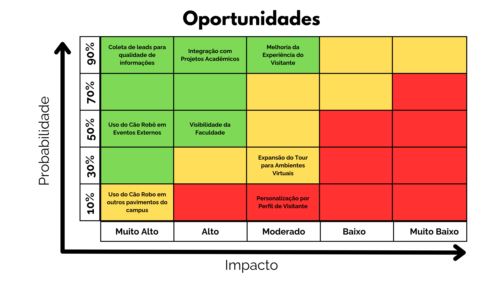

A matriz de oportunidades é uma ferramenta estratégica utilizada para identificar, avaliar e priorizar **potenciais ganhos e melhorias** que podem ser alcançados no projeto do **robô para tours interativos no campus do Inteli**. Assim como a matriz de riscos, ela considera duas dimensões principais — **Probabilidade** (chance de ocorrência) e **Impacto** (nível de benefício gerado) — permitindo à equipe concentrar esforços nas oportunidades mais promissoras e de maior valor agregado para o projeto e para a instituição.

---

## Metodologia

A matriz utiliza uma **escala 5x5**, classificando as oportunidades de acordo com o potencial de impacto e a probabilidade de concretização.

### Probabilidade

- **Muito Baixo (10%)**: Pouco provável de ocorrer
- **Baixo (30%)**: Oportunidade possível, mas depende de fatores externos
- **Moderado (50%)**: Oportunidade com chances equilibradas de acontecer
- **Alto (70%)**: Oportunidade com alta chance de concretização
- **Muito Alto (90%)**: Oportunidade quase certa de ocorrer

### Impacto

- **Muito Baixo**: Benefício limitado para o projeto
- **Baixo**: Melhoria pontual ou localizada
- **Moderado**: Melhoria perceptível na experiência ou nos processos
- **Alto**: Avanço significativo em desempenho, visibilidade ou eficiência
- **Muito Alto**: Transformação estrutural, grande diferencial competitivo

### Classificação por Cor

- **Verde**: Oportunidade altamente vantajosa e viável – prioridade de execução
- **Amarelo**: Oportunidade relevante – requer planejamento e análise de viabilidade
- **Vermelho**: Oportunidade de baixo retorno ou difícil implementação – monitorar

---

## Oportunidades Identificadas

### MUITO ALTAS (Impacto Muito Alto)

#### 1. Coleta de Leads para Qualidade de Informações

**Categoria**: Estratégica / Marketing
**Probabilidade**: Muito Alta (90%)
**Impacto**: Muito Alto

**Descrição**:

Implementar a coleta de leads durante o tour robótico, registrando informações básicas de visitantes (nome, e-mail, interesse em cursos) de forma consentida. Essa base pode aprimorar o relacionamento com potenciais candidatos e ampliar o alcance do Inteli.

**Benefícios Esperados**:

- Geração de banco de dados qualificado de visitantes
- Melhoria nas campanhas de comunicação e captação
- Acompanhamento de jornada do candidato (visitante → inscrito → aluno)
- Suporte estratégico às áreas de marketing e admissões

**Plano de Ação**:

- Integrar formulário digital com o robô e banco de dados institucional
- Garantir conformidade com a LGPD
- Utilizar prompts amigáveis para incentivo à coleta de informações

---

#### 2. Integração com Projetos Acadêmicos

**Categoria**: Acadêmica / Inovação
**Probabilidade**: Muito Alta (90%)
**Impacto**: Alto

**Descrição**:

Aproveitar o robô como plataforma viva de experimentação e integração entre diferentes disciplinas, turmas e projetos do Inteli, fortalecendo o ecossistema de inovação interna.

**Benefícios Esperados**:

- Engajamento de alunos e professores em melhorias contínuas
- Desenvolvimento interdisciplinar (IA, design, robótica, UX)
- Fomento à cultura de pesquisa aplicada
- Fortalecimento da imagem do Inteli como laboratório de inovação

**Plano de Ação**:

- Garantir a participação dos alunos nas áreas de desenvolvimento do projeto
- Estabelecer relação do projeto com as disciplinas
- Documentar casos de uso e resultados acadêmicos

---

### ALTAS (Impacto Alto)

#### 3. Melhoria da Experiência do Visitante

**Categoria**: Experiência do Usuário
**Probabilidade**: Muito Alta (90%)
**Impacto**: Moderado

**Descrição**:

Utilizar o robô para proporcionar uma experiência imersiva, personalizada e interativa para os visitantes do campus, destacando o caráter tecnológico e inovador do Inteli.

**Benefícios Esperados**:

- Aumento da satisfação dos visitantes
- Experiência diferenciada, inovadora e memorável
- Reforço da percepção de inovação da instituição
- Potencial de viralização em redes sociais

**Plano de Ação**:

- Implementar elementos de interação humano-robô
- Adicionar personalização baseada em perfil (ex: estudante, executivo, etc)
- Criar narrativa guiada durante o tour
- Coletar feedback de visitantes para melhoria contínua

---

#### 4. Uso do Cão Robô em Eventos Externos

**Categoria**: Divulgação / Extensão
**Probabilidade**: Moderada (50%)
**Impacto**: Muito Alto

**Descrição**:

Participação do robô em eventos externos (feiras, congressos, escolas, empresas) para demonstrar o potencial tecnológico do Inteli e atrair novos públicos.

**Benefícios Esperados**:

- Expansão da visibilidade institucional
- Captação de novos alunos e parcerias
- Fortalecimento da marca e da presença em eventos de tecnologia
- Diferenciação frente a outras instituições

**Plano de Ação**:

- Criar roteiro adaptável para apresentações externas
- Estabelecer logística de transporte e suporte técnico
- Garantir conexão segura e modo offline para demonstrações
- Registrar métricas de engajamento e conversão

---

#### 5. Visibilidade da Faculdade

**Categoria**: Comunicação / Branding
**Probabilidade**: Moderado (50%)
**Impacto**: Alto

**Descrição**:

A presença do robô no campus, interagindo com visitantes e alunos, reforça a imagem do Inteli como referência em tecnologia e inovação educacional.

**Benefícios Esperados**:

- Fortalecimento da marca institucional
- Maior interesse da mídia e imprensa
- Aumento de busca orgânica sobre o Inteli
- Potencial de uso em campanhas publicitárias

**Plano de Ação**:

- Criar identidade visual para o robô
- Incluir o robô em tours internos e eventos externos
- Produzir conteúdo audiovisual sobre as interações
- Estabelecer presença digital do robô em redes sociais

---

### MODERADAS

#### 6. Expansão do Tour para Ambientes Virtuais

**Categoria**: Tecnológica / Experiencial
**Probabilidade**: Baixa (30%)
**Impacto**: Moderado

**Descrição**:

Desenvolver uma versão virtual ou híbrida do tour, permitindo que visitantes explorem o campus remotamente com o auxílio do robô ou de um ambiente 3D interativo.

**Benefícios Esperados**:

- Inclusão de visitantes de outras regiões
- Acesso remoto para escolas parceiras e eventos online
- Fortalecimento da presença digital do Inteli
- Possibilidade de integração com realidade virtual

**Plano de Ação**:

- Criar tour virtual sincronizado com informações do robô
- Mapear o campus em alta definição
- Disponibilizar versão em site institucional

---

#### 7. Uso do Cão Robô em Outros Pavimentos do Campus

**Categoria**: Operacional / Logística
**Probabilidade**: Muito Baixa (10%)
**Impacto**: Muito Alto

**Descrição**:

Expandir a operação do robô para diferentes andares e ambientes do campus, ampliando a área de cobertura e interação.

**Benefícios Esperados**:

- Maior autonomia operacional
- Interações mais completas e representativas do espaço
- Potencial para tours segmentados (ex: laboratórios, biblioteca, ateliê)

**Plano de Ação**:

- Adaptação de infraestrutura (rampas, escadas, etc)
- Definição de protocolos de deslocamento entre pavimentos
- Testes de navegação em outros pavimentos

---

### BAIXAS

#### 8. Personalização por Perfil de Visitante

**Categoria**: IA / Experiência do Usuário
**Probabilidade**: Muito Baixa (10%)
**Impacto**: Moderado

**Descrição**:

Desenvolver um sistema de personalização dinâmica, ajustando o conteúdo do tour conforme o tipo de visitante (ex: candidato, parceiro, imprensa).

**Benefícios Esperados**:

- Experiência altamente relevante e direcionada
- Aumento do engajamento durante o tour
- Feedback mais positivo e maior taxa de conversão

**Plano de Ação**:

- Implementar reconhecimento de perfil via QR code ou login prévio
- Criar roteiros e mensagens específicas para cada público
- Treinar IA generativa para ajustar linguagem e foco temático
- Coletar métricas de engajamento por perfil

---

## Considerações Finais

A **matriz de oportunidades** oferece uma visão clara sobre os caminhos de evolução do projeto e seu potencial de impacto dentro e fora do campus do Inteli.
Ao identificar, priorizar e estruturar essas oportunidades, a equipe pode:

- Ampliar o valor percebido do projeto
- Fortalecer a imagem institucional de inovação
- Engajar alunos, visitantes e parceiros
- Maximizar o retorno sobre o investimento e a experiência proporcionada

Assim como a matriz de riscos, este documento deve ser continuamente atualizado, permitindo que **novas oportunidades** sejam mapeadas e incorporadas de forma estratégica ao longo do ciclo de vida do projeto.
