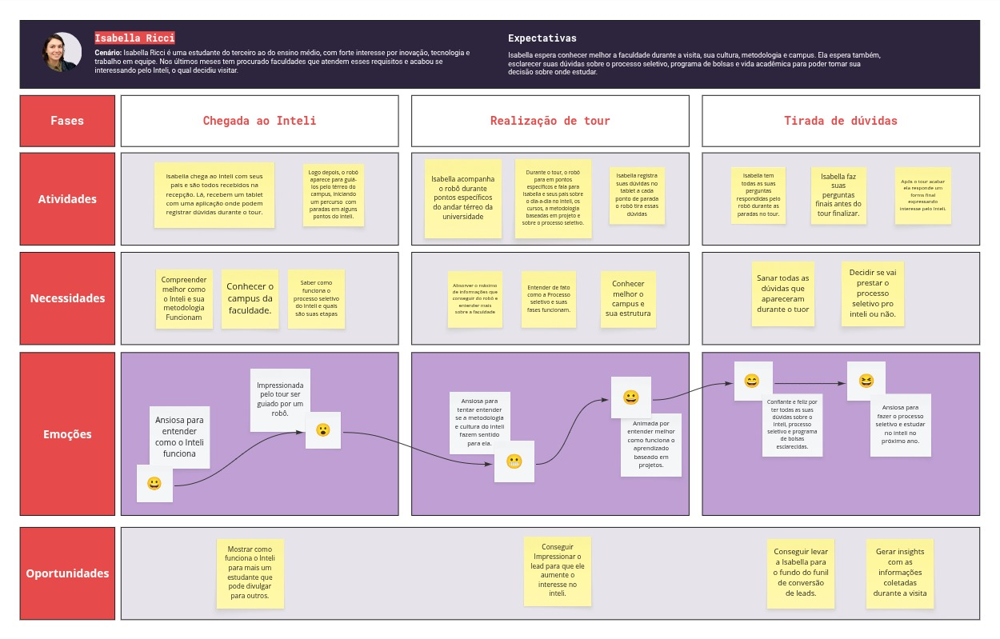

import { Steps } from "fumadocs-ui/components/steps";
import { Card, Cards } from "fumadocs-ui/components/card";
import { Callout } from "fumadocs-ui/components/callout";

## 1. Visão Geral da Jornada

&emsp;A jornada do usuário de **Isabella Ricci**, uma estudante de 17 anos no último ano do ensino médio, foi mapeada para compreender sua experiência durante a **visita ao Inteli**. Isabella demonstra forte interesse por inovação, tecnologia e projetos colaborativos, buscando uma instituição que una propósito, prática e aprendizado real.  
&emsp;Seu principal objetivo na visita é conhecer melhor o ambiente, entender a metodologia baseada em projetos e esclarecer dúvidas sobre **bolsas, processo seletivo e vida acadêmica** antes de decidir onde estudar.

  Figura 1 - Mapa da Jornada do Usuário: Isabella Ricci{" "}

  

    
  

Fonte: Os autores (2025)

&emsp;O mapa da jornada mostra as três fases principais da experiência de Isabella: **Chegada ao Inteli**, **Realização do Tour** e **Tirada de Dúvidas**, destacando suas atividades, necessidades, emoções e oportunidades de melhoria da experiência com o robô-guia.

## 2. Detalhamento das Fases da Jornada

<Steps>

### Fase 1: Chegada ao Inteli

**Atividades:**

- Isabella chega ao Inteli com seus pais e é recebida pela equipe de recepção.
- Recebe um tablet para registrar suas dúvidas durante o tour.
- O robô é apresentado e inicia o percurso pelos primeiros pontos do campus.

**Necessidades:**

- Compreender melhor como o Inteli e sua metodologia funcionam.
- Conhecer o campus da faculdade e o ambiente de aprendizado.

**Emoções:**

- 😃 Ansiosa para entender como o Inteli funciona.
- 😯 Impressionada ao descobrir que o tour é guiado por um robô desenvolvido pelos próprios alunos.

**Oportunidade:**

- Mostrar como o Inteli funciona para mais uma estudante que pode divulgar a experiência para outros.

### Fase 2: Realização do Tour

**Atividades:**

- Isabella acompanha o robô pelos pontos do campus.
- O robô explica a metodologia de ensino, os projetos e o processo seletivo.
- Ela anota suas dúvidas no tablet a cada ponto de parada o robô tira essas dúvidas.

**Necessidades:**

- Entender de fato como a metodologia e o processo seletivo funcionam.
- Conhecer melhor o campus e a estrutura da faculdade.

**Emoções:**

- 🤔 Ansiosa para compreender se a metodologia faz sentido para ela.
- 😄 Animada ao perceber que o aprendizado por projetos é prático e colaborativo.

**Oportunidades:**

- Conseguir impressionar o lead (Isabella) para aumentar seu interesse no Inteli.

### Fase 3: Tirada de Dúvidas Finais

**Atividades:**

- Isabella tem suas dúvidas finais respondidas pelo robô no final do tour.
- Após o encerramento, reflete sobre a experiência e considera o ingresso no Inteli.

**Necessidades:**

- Sanar todas as dúvidas da Isabella.
- Decidir se prestará o processo seletivo no próximo ano.

**Emoções:**

- 😊 Confiante e feliz por ter tido suas dúvidas esclarecidas.
- 😃 Ansiosa para participar do processo seletivo e estudar no Inteli.

**Oportunidades:**

- Levar Isabella ao fundo do funil de conversão de leads.
- Gerar insights a partir das informações coletadas durante a visita.

</Steps>

## 3. Análise Detalhada dos Elementos da Jornada

### 3.1. Necessidades Principais

| Necessidade                               | Impacto no Tour Automatizado                                                     | Oportunidade de Conteúdo                                    |
| :---------------------------------------- | :------------------------------------------------------------------------------- | :---------------------------------------------------------- |
| **Compreender a metodologia do Inteli**   | Exige uma explicação clara e prática da aprendizagem baseada em projetos.        | Mostrar vídeos e exemplos de projetos reais de alunos.      |
| **Entender o processo seletivo e bolsas** | Deve incluir informações acessíveis e precisas sobre critérios, etapas e prazos. | Oferecer acesso direto a links e formulários de inscrição.  |
| **Conhecer o campus e o ambiente**        | Importante que o tour destaque o ecossistema de inovação.                        | Enfatizar a infraestrutura moderna e o clima de comunidade. |

### 3.2. Oportunidades Estratégicas

- Personalizar o tour para o perfil de estudante do ensino médio, reforçando a **proximidade e acolhimento**.
- Destacar a **autoria estudantil** do robô e dos projetos para aumentar o encantamento.
- Inserir **momentos interativos** que envolvam o visitante (ex: quizzes ou feedback instantâneo).
- Criar um fluxo de **follow-up automatizado**, enviando informações adicionais sobre o processo seletivo após o tour.

## 4. Conclusão

&emsp;A jornada de Isabella Ricci demonstra como a visita guiada por robô pode ser uma experiência **imersiva e inspiradora** para estudantes do ensino médio. Ao combinar tecnologia, interatividade e informação prática, o tour não apenas apresenta o Inteli, mas **desperta o desejo de pertencer** à comunidade acadêmica.  
&emsp;Com uma condução empática e com exemplos reais, o robô pode transformar o interesse inicial de Isabella em uma **decisão consciente de se candidatar ao Inteli**.
