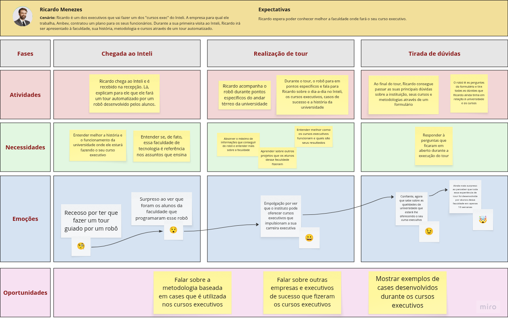

import { Steps } from 'fumadocs-ui/components/steps';
import { Card, Cards } from 'fumadocs-ui/components/card';
import { Callout } from 'fumadocs-ui/components/callout';

## 1. Visão Geral da Jornada

&emsp;A jornada do usuário de **Ricardo Menezes**, um executivo da Ambev que fará um curso executivo no Inteli, foi mapeada para garantir que a experiência de primeiro contato com a instituição atenda às suas necessidades de **validação, credibilidade e informação estratégica**. O objetivo principal é transformar a desconfiança inicial em **confiança e empolgação** em relação à qualidade do curso e à vanguidez tecnológica da faculdade.

&emsp;Abaixo, está o mapa visual da jornada do usuário Ricardo Menezes. O mapa pode ser visualizado também no Miro através do [link ](https://miro.com/welcomeonboard/NFFEdGZFeWN0YTZTQ2RCM0R0a1BBMVJLMC9XTHpDTkFJS1JwRVJ0MDVna1BrSmFYamkxalN5TUppa1lmMERxT2ZnVUQrNEFjQnB5L1lPWGZCWTg4K201Uk81SWljVS9EYTZjc1dNdGQwQjdpdmRYUG56eS9wS3FWNGs0dCtIRGN3VHhHVHd5UWtSM1BidUtUYmxycDRnPT0hdjE=?share_link_id=721060916898).

Figura 1 - Mapa da Jornada do Usuário: Ricardo Menezes

  

    
  

Fonte: Os autores (2025)

&emsp;O mapa da jornada é uma ferramenta essencial para visualizar a experiência de Ricardo, destacando os pontos de contato críticos, as emoções em cada fase e as oportunidades de intervenção do robô-guia para superar as dores do usuário.

## 2. Detalhamento das Fases da Jornada

&emsp;A jornada é dividida em três fases principais, focadas na recepção, na imersão e no esclarecimento final de dúvidas.

<Steps>
### Fase 1: Chegada ao Inteli

**Atividade:** Ricardo chega ao Inteli e é recebido na recepção. É informado que fará um tour automatizado por um robô desenvolvido pelos alunos.

**Necessidades:**
*   Entender melhor a **história e o funcionamento** da universidade.
*   Confirmar se a faculdade de tecnologia é, de fato, **referência** nos assuntos que ensina.

**Emoções:**
*   **Receoso** por ter que fazer um tour guiado por um robô 😟.
*   **Surpreso** ao ver que foram os alunos da faculdade que programaram esse robô 😮.

**Oportunidade:**
*   A surpresa inicial com a autoria do robô (alunos) deve ser explorada para **validar a excelência técnica** da instituição logo no início.

### Fase 2: Realização do Tour

**Atividade:** Ricardo acompanha o robô em pontos específicos do andar térreo. O robô para e fala sobre o dia a dia no Inteli, os cursos executivos, casos de sucesso e a história da universidade.

**Necessidades:**
*   Absorver o máximo de informações do robô.
*   Entender melhor como os **cursos executivos funcionam** e quais são seus **resultados**.
*   Aprender sobre **outros projetos** que os alunos fizeram.

**Emoções:**
*   **Empolgação** por ver que o instituto pode oferecer cursos executivos que impulsionam sua carreira executiva 😉.
*   **Confiante**, agora que sabe sobre as qualidades da universidade que estará lhe oferecendo o curso executivo 😀.

**Oportunidades:**
*   Falar sobre a **metodologia baseada em cases** que é utilizada nos cursos executivos.
*   Citar **outras empresas e executivos de sucesso** que fizeram os cursos executivos.
*   Apresentar **exemplos de cases** desenvolvidos durante os cursos executivos.

### Fase 3: Tirada de Dúvidas

**Atividade:** Ricardo preenche um formulário com suas dúvidas. O robô lê as perguntas e tira todas as dúvidas restantes.

**Necessidades:**
*   **Responder a perguntas** que ficaram em aberto durante a execução do tour.

**Emoções:**
*   **Ainda mais surpreso** ao perceber que toda essa experiência de tour foi desenvolvida por alunos em apenas 10 semanas 🤯.

**Oportunidade:**
*   A fase final de Q&A (Perguntas e Respostas) deve ser um momento de **reforço da credibilidade**. A capacidade do robô de responder a dúvidas complexas, aliada à informação de que o projeto foi desenvolvido em 10 semanas, solidifica a imagem do Inteli como uma instituição de **alta performance e inovação**.

</Steps>

## 3. Análise Detalhada dos Elementos da Jornada

### 3.1. Necessidades Estratégicas

&emsp;As necessidades de Ricardo não são apenas logísticas, mas sim **estratégicas e de validação de investimento**. Ele precisa de informações que justifiquem o tempo e o recurso investido pela Ambev no curso.

| Necessidade | Impacto no Projeto do Robô | Oportunidade de Conteúdo |
| :--- | :--- | :--- |
| **Entender a história e o funcionamento do Inteli** | Requer um módulo de conteúdo institucional formal e conciso. | Foco nos **fundadores, missão e visão** de inovação. |
| **Validar a faculdade como referência em tecnologia** | Exige a apresentação de **evidências concretas** e cases de sucesso. | Mencionar parcerias estratégicas e o **desempenho dos alunos** no mercado. |
| **Compreender os cursos executivos e seus resultados** | Demanda dados sobre a **metodologia**, o corpo docente e o **ROI** (Retorno sobre o Investimento) do curso. | Apresentar métricas de sucesso de ex-alunos e a **metodologia *case-based***. |
| **Absorver o máximo de informações** | Necessidade de uma comunicação clara, madura e com a **opção de aprofundamento** (como o formulário de dúvidas). | Oferecer acesso a materiais complementares após o tour. |

### 3.2. Oportunidades de Conteúdo e Intervenção

&emsp;As oportunidades identificadas são cruciais para que o robô atue como um **agente de convencimento e credibilidade**.
* Explicar como a aprendizagem por projetos e casos reais (case-based) torna o conhecimento mais aplicável e relevante para executivos como Ricardo.
* Citar nominalmente outras empresas e executivos de prestígio que já realizaram os cursos, utilizando o **endosso social** para construir confiança.
* Mostrar resultados tangíveis dos cursos, como projetos de IA ou Data Science que geraram **valor real** para as empresas dos alunos.
## 4. Conclusão

&emsp;A jornada de Ricardo Menezes é um excelente exemplo de como a **tecnologia (o robô-guia)** pode ser utilizada não apenas para automação, mas como uma **ferramenta estratégica de marketing e validação institucional**. O sucesso da experiência depende da capacidade do robô de alternar de um tom lúdico (para o público jovem) para um **tom formal, baseado em dados e resultados** (para executivos).

&emsp;Ao endereçar a desconfiança inicial com a **surpresa da autoria estudantil** e finalizar com a **confiança nos resultados e na metodologia**, o Inteli garante que Ricardo saia do tour não apenas informado, mas **convencido da excelência e da vanguarda** da instituição que sediará seu desenvolvimento executivo.
