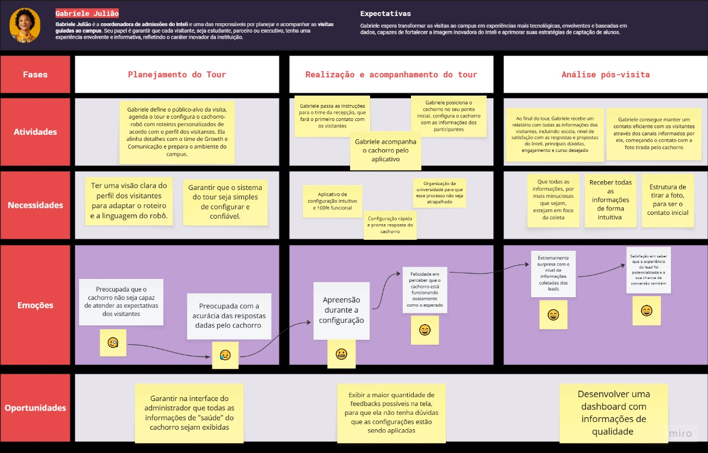

import { Steps } from "fumadocs-ui/components/steps";
import { Card, Cards } from "fumadocs-ui/components/card";
import { Callout } from "fumadocs-ui/components/callout";

## 1. Visão Geral da Jornada

&emsp;A jornada do usuário de Gabriele Julião, coordenadora de admissões do Inteli, foi mapeada para garantir que sua experiência com o sistema do cachorro-robô atenda às necessidades de eficiência, engajamento e coleta inteligente de dados. O objetivo principal é transformar o tour tradicional em uma experiência tecnológica e estratégica, que facilite a captação de leads, gere insights sobre o comportamento dos visitantes e consolide o Inteli como referência em tecnologia no país.  
&emsp;Abaixo, está o mapa visual da jornada da Gabriele Julião. O mapa pode ser visualizado também no Miro através do [link](https://miro.com/welcomeonboard/NFFEdGZFeWN0YTZTQ2RCM0R0a1BBMVJLMC9XTHpDTkFJS1JwRVJ0MDVna1BrSmFYamkxalN5TUppa1lmMERxT2ZnVUQrNEFjQnB5L1lPWGZCWTg4K201Uk81SWljVS9EYTZjc1dNdGQwQjdpdmRYUG56eS9wS3FWNGs0dCtIRGN3VHhHVHd5UWtSM1BidUtUYmxycDRnPT0hdjE=?share_link_id=721060916898).

  Figura 1 - Mapa da Jornada da Gabriele Julião{" "}

  

    
  

Fonte: Os autores (2025)

&emsp;Esse mapa revela um aspecto importante da vivência de Gabriele como coordenadora de admissões: a apreensão em relação ao funcionamento do tour. Embora a jornada do usuário apresente o caminho ideal, onde tudo acontece exatamente como planejado, é importante destacar o momento de insegurança que antecede o uso do robô, marcado pelo receio de que a tecnologia não responda como esperado. Essa tensão reflete tanto a responsabilidade que Gabriele carrega em garantir que esse primeiro contato com o Inteli seja uma boa experiência quanto o desafio natural de confiar em uma ferramenta tão nova dentro de um contexto real.

## 2. Detalhamento das Fases da Jornada

&emsp;Essa jornada é composta de três fases principais: Planejamento do Tour, Realização e Acompanhamento do Tour e a Análise Pós-visita.

<Steps>
### Fase 1: Planejamento do Tour

**Atividade:** Gabriele define o público-alvo da visita, agenda o tour e configura o cachorro-robô com roteiros personalizados de acordo com o perfil dos visitantes. Ela alinha detalhes com o time de Growth e Comunicação e prepara o ambiente do campus.

**Necessidades:**

- Ter uma visão clara do perfil dos visitantes para adaptar o roteiro e a linguagem do robô.
- Garantir que o sistema do tour seja simples de configurar e confiável.

**Emoções:**

- **Preocupada** que o cachorro não seja capaz de atender as expectativas dos visitantes 🧐.
- **Preocupada** com a acurácia das respostas dadas pelo cachorro  😥.

**Oportunidade:**

- Garantir na interface do administrador que todas as informações de "saúde" do cachorro sejam exibidas.

### Fase 2: Realização e acompanhamento do tour

**Atividades:**

- Gabriele passa as instruções para o time da recepção, que fará o primeiro contato com os visitantes.
- Gabriele acompanha o cachorro pelo aplicativo.
- Gabriele posiciona o cachorro no seu ponto inicial, configura o cachorro com as informações dos participantes.

**Necessidades:**

- Aplicativo de configuração intuitivo e 100% funcional.
- Configuração rápida e pronta resposta do cachorro.
- Organização da universidade para que esse processo não seja atrapalhado.

**Emoções:**

- **Apreensão** durante a configuração 😬.
- **Felicidade** em perceber que o cachorro está funcionando exatamente como o esperado 😄.

**Oportunidades:**

- Exibir a maior quantidade de feedbacks possíveis na tela, para que ela não tenha dúvidas que as configurações estão sendo aplicadas.

### Fase 3: Análise pós-visita

**Atividades:**

- Ao final do tour, Gabriele recebe um relatório com todas as informações dos visitantes, incluindo: escola, nível de satisfação com as respostas e propostas do Inteli, principais dúvidas, engajamento e curso desejado.
- Gabriele consegue manter um contato eficiente com os visitantes através dos canais informados por ele, começando o contato com a foto tirada pelo cachorro.

**Necessidades:**

- Que todas as informações, por mais minuciosas que sejam, estejam em foco da coleta.
- Receber todas as informações de forma intuitiva.
- Estrutura de tirar a foto, para ser o contato inicial.

**Emoções:**

- Extremamente **surpresa** com o nível de informações coletadas dos leads 😄.
- **Satisfação** em saber que a experiência do lead foi potencializada e a sua chance de conversão também 😄.

**Oportunidade:**

- Desenvolver uma dashboard com informações de qualidade.

</Steps>

## 3. Análise Detalhada dos Elementos da Jornada

### 3.1. Necessidades Estratégicas

&emsp;As necessidades de Gabriele estão diretamente ligadas à sua função de coordenadora de admissões, e não apenas à execução do tour em si, mas ao uso estratégico do sistema como uma ferramenta de captação, análise e fortalecimento institucional. Ela busca aprimorar a experiência dos visitantes, obter dados que orientem decisões futuras e reforçar o posicionamento do Inteli como referência em tecnologia e inovação.

| Necessidade                                                   | Impacto no Projeto do Robô                                                                      | Oportunidade de Conteúdo                                                                  |
| :------------------------------------------------------------ | :---------------------------------------------------------------------------------------------- | :---------------------------------------------------------------------------------------- |
| **Coletar dados precisos sobre o engajamento dos visitantes** | Requer integração do robô com um painel analítico que registre interações, dúvidas e emoções.   | Exibir métricas de engajamento e gerar relatórios automáticos pós-tour.                   |
| **Garantir que o tour funcione de forma confiável e fluida**  | Demanda estabilidade técnica, interface intuitiva e suporte em tempo real.                      | Criar mensagens e comportamentos que transmitam segurança e profissionalismo.             |
| **Refletir a identidade e o tom institucional do Inteli**     | Necessita de conteúdo alinhado à linguagem da marca e à narrativa de inovação e impacto social. | Inserir falas que reforcem os valores, missão e diferenciais do Inteli.                   |
| **Otimizar o tempo e a logística das visitas**                | Requer automação no agendamento, personalização de roteiros e acompanhamento remoto.            | Permitir a configuração de tours distintos conforme o público (escolas, empresas, mídia). |

### 3.2. Oportunidades de Conteúdo e Intervenção

&emsp;As oportunidades identificadas na jornada da Gabriele têm foco em otimizar o uso do robô como ferramenta de captação e análise de dados, transformando o tour em uma experiência envolvente e estratégica.

- Criar mecanismos automáticos de coleta de feedbacks e métricas de engajamento que permitam a Gabriele ajustar futuras visitas.
- Incorporar falas do robô que reforcem a imagem institucional, destacando inovação, metodologias práticas e impacto social.
- Permitir que Gabriele acompanhe o tour em tempo real por meio de um painel administrativo simples e visual.
- Inserir momentos de interação leve e personalizada com os visitantes, reforçando o caráter humano e acolhedor da experiência.
- Transformar o tour em uma ferramenta de inteligência de marketing, capaz de gerar insights sobre o perfil e o comportamento dos leads.

## 4. Conclusão

&emsp;A jornada de Gabriele Julião evidencia como o cachorro-robô pode ir além da automatização de visitas, atuando como uma ferramenta estratégica de captação e análise de leads. Para ela, o sucesso do sistema não se resume à fluidez técnica do tour, mas à sua capacidade de gerar dados relevantes, engajar visitantes e reforçar a imagem inovadora do Inteli.  
&emsp;Ao transformar um processo tradicional em uma experiência interativa, tecnológica e orientada por dados, o robô auxilia Gabriele a compreender melhor o comportamento dos visitantes e aprimorar continuamente as estratégias de admissão. Assim, o projeto não apenas otimiza o trabalho da coordenadora, mas também fortalece o posicionamento do Inteli como uma instituição que une inovação, educação e inteligência de mercado.
