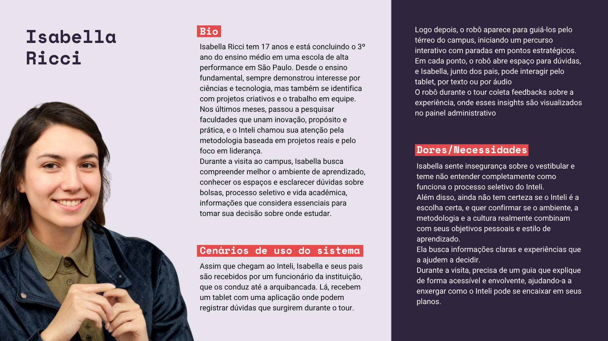

# Isabella Ricci

&emsp;Isabella Ricci tem 17 anos e está concluindo o 3º ano do ensino médio em uma escola de alta performance em São Paulo. Desde o ensino fundamental, sempre demonstrou interesse por ciências e tecnologia, mas também se identifica com projetos criativos e o trabalho em equipe. Nos últimos meses, passou a pesquisar faculdades que unam inovação, propósito e prática, e o Inteli chamou sua atenção pela metodologia baseada em projetos reais e pelo foco em liderança.
&emsp;Durante a visita ao campus, Isabella busca compreender melhor o ambiente de aprendizado, conhecer os espaços e esclarecer dúvidas sobre bolsas, processo seletivo e vida acadêmica, informações que considera importantes para tomar sua decisão sobre onde estudar. Segue abaixo o canva da persona:

Figura 1 - Isabella Ricci 

  

    
  

Fonte: Os autores (2025)

## Cenários de uso do sistema

&emsp;Assim que chegam ao Inteli, Isabella e seus pais são recebidos por um funcionário da instituição, que os conduz até a arquibancada. Lá, recebem um tablet com uma aplicação onde podem registrar dúvidas durante o tour. Logo depois, o robô aparece para guiá-los pelo térreo do campus, iniciando um percurso interativo com paradas em pontos estratégicos. Em cada ponto, o robô abre espaço para perguntas, e Isabella, junto dos pais, pode interagir pelo tablet, por texto ou por áudio.

&emsp;Durante o tour, o robô coleta feedbacks sobre a experiência, que são armazenados e posteriormente visualizados no painel administrativo.

## Dores e necessidades

&emsp;Isabella sente insegurança em relação ao vestibular e ao processo de transição do ensino médio para o ensino superior. Ela teme não compreender completamente como funciona o processo seletivo do Inteli e tem dúvidas sobre o nível de exigência e o perfil de aluno esperado pela instituição.Essa incerteza é reforçada pelo fato de ainda não ter decidido se irá prestar o processo seletivo, o que torna a visita uma oportunidade importante para esclarecer dúvidas e reduzir barreiras emocionais na tomada de decisão. Ela deseja confirmar se o ambiente acadêmico, a metodologia de ensino e a cultura institucional realmente se alinham aos seus objetivos pessoais e à sua forma de aprendizado. Seu interesse por tecnologia e criatividade é acompanhado de uma necessidade de pertencimento e identificação com a proposta educacional.

&emsp;Durante a visita, Isabella busca informações objetivas, mas também experiências que transmitam segurança e transparência. Ela valoriza interações que equilibrem clareza técnica e sensibilidade humana. O contato com o robô deve contribuir para esse processo, apresentando o Inteli de forma acessível, guiada e contextual, permitindo que Isabella enxergue com mais nitidez como o ambiente e a metodologia podem apoiar seu desenvolvimento acadêmico e pessoal.

## Objetivos

&emsp;O principal objetivo de Isabella ao visitar o Inteli é avaliar se deseja prestar o processo seletivo da instituição. Ela está em um momento de indecisão e busca informações que a ajudem a confirmar se o modelo de ensino, o ambiente e a proposta do curso correspondem às suas expectativas de formação.

&emsp;Outro objetivo é conhecer o espaço físico e observar como os ambientes de estudo e convivência favorecem a aprendizagem e a colaboração entre os alunos. Essa dimensão visual da experiência é importante para que Isabella forme uma percepção concreta sobre o dia a dia acadêmico e a estrutura da instituição.

&emsp; Ela também busca entender a metodologia de ensino baseada em projetos, compreendendo na prática como os estudantes aprendem, interagem e desenvolvem soluções reais. Esse entendimento é necessário para que ela perceba o diferencial do Inteli em relação a outras instituições de ensino superior.

&emsp;Durante o tour, Isabella deseja esclarecer dúvidas sobre bolsas, rotina e oportunidades extracurriculares, como ligas estudantis e projetos paralelos. Essas informações têm um papel prático na decisão da família, especialmente no aspecto financeiro e no equilíbrio entre estudo e vivência universitária.

## Conclusão

&emsp;A persona **Isabella Ricci** representa o perfil de candidato em fase de descoberta, que visita o Inteli acompanhado dos pais para conhecer o campus e avaliar a possibilidade de ingressar na instituição. Sua jornada é marcada por dúvidas sobre o processo seletivo, o ambiente acadêmico e a adequação entre seu perfil e a metodologia de ensino proposta.

&emsp;As dores e necessidades de Isabella revelam um equilíbrio entre fatores emocionais e racionais: ela busca informações claras, mas também experiências que transmitam segurança e identificação. O tour conduzido pelo robô tem papel fundamental nesse processo, funcionando como um canal de mediação entre o visitante e a instituição, capaz de esclarecer dúvidas e gerar percepção de acolhimento e transparência.

&emsp;Seus objetivos se concentram em compreender o funcionamento do Inteli, conhecer os espaços, tirar dúvidas sobre bolsas e oportunidades, e, principalmente, confirmar se deseja participar do processo seletivo. A partir dessa experiência, espera obter elementos concretos e emocionais que a ajudem a decidir sobre seu futuro acadêmico, reforçando a importância do projeto como ponto de contato inicial entre candidatos e o Inteli.
