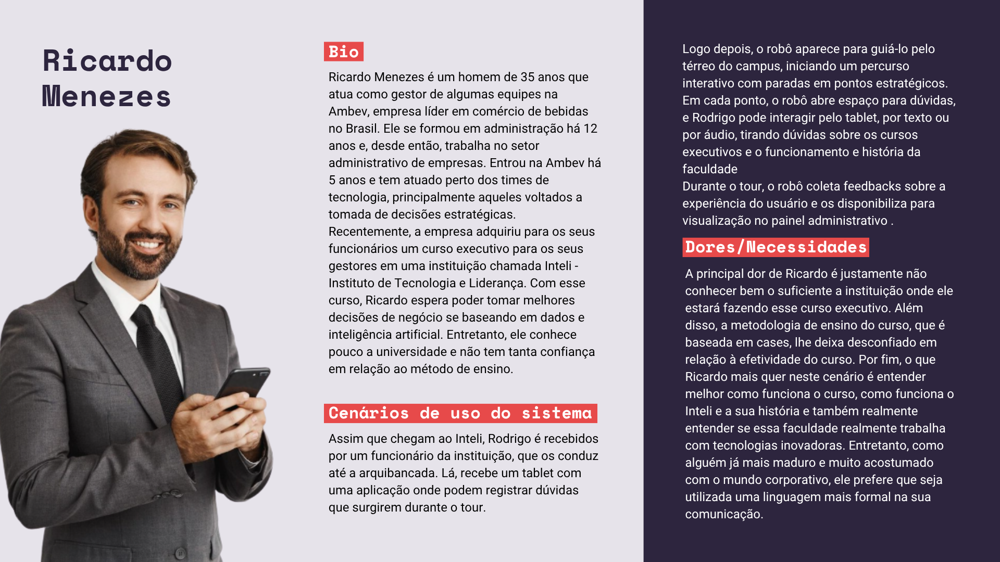

&emsp;Abaixo, é possível ver um canva com um detalhamento acerca da persona Ricardo Menezes

Figura 1 - Persona Ricardo Menezes 

  

    
  

Fonte: Os autores (2025)

## Resumo da Persona

&emsp;Ricardo Menezes é um gestor de 35 anos que trabalha na Ambev, onde atua na gestão de equipes e colabora com times de tecnologia voltados à tomada de decisões estratégicas. Sua principal motivação é o curso executivo adquirido pela empresa no Inteli, do qual ele espera obter conhecimentos em dados e inteligência artificial para aprimorar suas decisões de negócio. Contudo, Ricardo chega ao Inteli com uma dor central: a desconfiança e o desconhecimento em relação à instituição e à sua metodologia de ensino baseada em cases, o que o faz questionar a real efetividade do curso. Seu objetivo primário durante a visita é entender melhor o funcionamento do curso, a história da faculdade e confirmar se o Inteli realmente emprega tecnologias inovadoras, exigindo para isso uma comunicação formal e madura, alinhada ao seu perfil corporativo. O cenário de uso do sistema envolve ser conduzido por um funcionário até a arquibancada, onde recebe um tablet para registrar dúvidas, e em seguida ser guiado pelo robô interativo em um percurso pelo térreo do campus, podendo interagir com o robô por texto ou áudio no tablet para sanar suas dúvidas logísticas e conceituais sobre a faculdade e o curso. O robô, por sua vez, coleta feedbacks de sua experiência para otimizar o processo.

## Informações Demográficas

| Atributo                         | Detalhe                                            |
| :------------------------------- | :------------------------------------------------- |
| **Idade**                        | 38 anos                                            |
| **Gênero**                       | Masculino                                          |
| **Profissão**                    | Gerente de Projetos Sênior na Ambev                |
| **Formação**                     | Administração de Empresas                          |
| **Localização**                  | São Paulo (SP)                                     |
| **Familiaridade com Tecnologia** | Médio. usa ferramentas digitais, mas não é técnico |

## Bio

&emsp;Como dito anteriormente, Ricardo Menezes é um homem de 35 anos que atua como gestor de algumas equipes na Ambev, empresa líder em comércio de bebidas no Brasil. Ele se formou em administração há 12 anos e, desde então, trabalha no setor administrativo de empresas. Entrou na Ambev há 5 anos e tem atuado perto dos times de tecnologia, principalmente aqueles voltados à tomada de decisões estratégicas.
Recentemente, a empresa adquiriu para os seus funcionários um curso executivo para os seus gestores em uma instituição chamada Inteli - Instituto de Tecnologia e Liderança. Com esse curso, Ricardo espera poder tomar melhores decisões de negócio baseando-se em dados e inteligência artificial. Entretanto, ele conhece pouco a universidade e não tem tanta confiança em relação ao método de ensino.

## Cenários de Uso do Sistema

&emsp;Assim que chegam ao Inteli, Rodrigo é recebidos por um funcionário da instituição, que os conduz até a arquibancada. Lá, recebe um tablet com uma aplicação onde podem registrar dúvidas que surgirem durante o tour. Logo depois, o robô aparece para guiá-lo pelo térreo do campus, iniciando um percurso interativo com paradas em pontos estratégicos.
Em cada ponto, o robô abre espaço para dúvidas, e Rodrigo pode interagir pelo tablet, por texto ou por áudio, tirando dúvidas sobre os cursos executivos e o funcionamento e história da faculdade
Durante o tour, o robô coleta feedbacks sobre a experiência do usuário e os disponibiliza para visualização no painel administrativo .

## Dores e Necessidades

&emsp;A principal dor de Ricardo é justamente não conhecer bem o suficiente a instituição onde ele estará fazendo esse curso executivo. Além disso, a metodologia de ensino do curso, que é baseada em cases, lhe deixa desconfiado em relação à efetividade do curso. Por fim, o que Ricardo mais quer neste cenário é entender melhor como funciona o curso, como funciona o Inteli e a sua história e também entender se essa faculdade realmente trabalha com tecnologias inovadoras. Entretanto, como alguém já mais maduro e muito acostumado com o mundo corporativo, ele prefere que seja utilizada uma linguagem mais formal na sua comunicação.

## Conclusão

&emsp;Embora a maioria dos visitantes do Inteli seja composta por estudantes do ensino médio, a persona Ricardo Menezes representa um público-alvo estratégico (executivos, imprensa e parceiros) cujo impacto no projeto de automatização de tours com o cão robótico é desproporcionalmente alto. Este público não busca uma experiência lúdica, mas sim a validação da credibilidade e da vanguarda tecnológica da instituição. A presença do Ricardo exige que o robô seja programado para ter uma dupla funcionalidade: além de engajar o público jovem, ele deve ser capaz de alternar para um tom de voz formal, comunicação concisa e conteúdo focado em dados estratégicos (como cases de sucesso e resultados de cursos executivos). Em suma, o Ricardo atua como o padrão de qualidade para o projeto, garantindo que a solução tecnológica não apenas cumpra seu papel operacional de guia, mas também funcione como um reforço da imagem institucional do Inteli para o seu público mais influente e decisório. Ignorar as dores e necessidades deste executivo resultaria em um robô que falharia em seu papel mais importante: endossar a sofisticação e o profissionalismo da faculdade.
