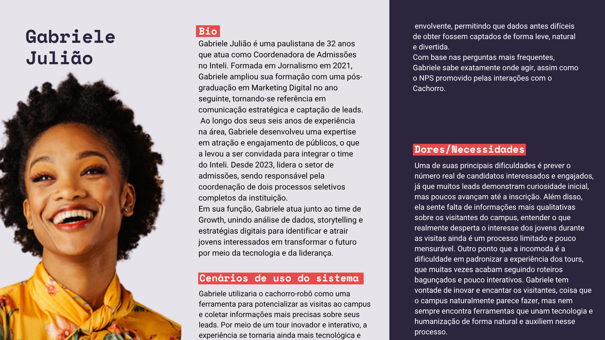

&emsp;A imagem abaixo ajuda a compreender de forma mais visual quem é Gabriele e como ela se conecta com o contexto do projeto: 

Figura 1 - Persona Gabriele Julião

  

    
  

Fonte: Os autores (2025)

## Resumo da persona

&emsp;Gabriele Julião é uma profissional paulistana de 32 anos que atua como coordenadora de admissões no Inteli, sendo responsável por gerenciar os processos seletivos e as visitas guiadas ao campus. Formada em Jornalismo e pós-graduada em Marketing Digital, Gabriele possui experiência em captação de leads e estratégias de comunicação voltadas à atração de jovens talentos. Sua principal motivação é aprimorar a experiência dos visitantes e fortalecer a imagem inovadora da instituição, tornando cada interação uma oportunidade de encantamento e conversão.  
&emsp;Apesar dos bons resultados alcançados nas últimas campanhas de admissão, Gabriele enfrenta desafios como a dificuldade de mensurar o impacto das visitas ao campus e obter dados mais qualitativos sobre o interesse dos candidatos. Por isso, vê no cachorro-robô uma ferramenta estratégica para transformar o tour em uma experiência mais tecnológica, interativa e informativa. Durante as visitas, Gabriele acompanha o funcionamento do robô e analisa os dados coletados para compreender melhor o comportamento e o engajamento dos leads. Assim, ela busca unir tecnologia, inovação e marketing educacional para aprimorar o processo de admissão e otimizar a jornada dos futuros alunos do Inteli.

## Informações Demográficas

| Atributo                         | Detalhe                                            |
| :------------------------------- | :------------------------------------------------- |
| **Idade**                        | 32 anos                                            |
| **Gênero**                       | Feminino                                          |
| **Profissão**                    | Coordenadora de admissões no Inteli               |
| **Formação**                     | Jornalismo, com pós graduação em Marketing Digital                          |
| **Localização**                  | São Paulo (SP)                                     |
| **Familiaridade com Tecnologia** | Alta. Utiliza muitas mídias sociais, entende de fluxos e sabe muito sobre o seu público-alvo: futuros líderes em tecnologia. |

## Bio

&emsp;Gabriele Julião é uma paulistana de 32 anos, comunicativa e sempre em busca de novas formas de se conectar com as pessoas. Formada em Jornalismo e pós-graduada em Marketing Digital, ela construiu sua carreira unindo criatividade e estratégia, o que a levou a se tornar coordenadora de admissões no Inteli, onde lidera campanhas e visitas ao campus.  
&emsp;Fora do trabalho, Gabriele é movida por curiosidade e expressão. Ela adora fotografia, cinema e música brasileira, e costuma aproveitar os fins de semana para explorar novos cafés e registrar momentos do cotidiano de São Paulo. Gosta de estar rodeada de amigos e é conhecida por seu bom humor e energia em eventos da faculdade. Ela ama visitar ambientes "aesthetic", como cafés superfaturados no centro da cidade e museus culturais. Sua atividade favorita com os amigos é ir ao Beco do Batman.  
&emsp;Ao mesmo tempo, Gabriele tem um lado analítico e curioso: adora entender o comportamento das pessoas e buscar maneiras de transformar dados em histórias que inspiram. É esse equilíbrio entre empatia e estratégia que a faz enxergar o potencial de ferramentas inovadoras, como o cachorro-robô para transformar a experiência dos visitantes do Inteli em algo inesquecível.

## Cenários de Uso do Sistema

&emsp;Assim que chegam ao Inteli, Gabriele recebe um grupo de visitantes interessados em conhecer a instituição. Ela aciona o cachorro-robô, que inicia o tour guiado pelo térreo do campus. Os visitantes recebem um tablet conectado ao sistema do robô, por meio do qual pode interagir durante o percurso, enviando dúvidas por texto ou áudio.  
&emsp;Enquanto o robô conduz o grupo de forma autônoma, Gabriele acompanha o tour à distância, observando o andamento pelo painel administrativo. A cada ponto de parada, o robô compartilha informações sobre o curso, os laboratórios, os projetos dos alunos e a cultura da instituição, estimulando o engajamento dos visitantes.  
&emsp;Durante a experiência, o sistema coleta feedbacks e dados comportamentais, como nível de interesse e interação dos visitantes, permitindo que Gabriele obtenha informações mais ricas sobre o perfil dos leads. Ao final do tour, ela utiliza esses dados para aprimorar as próximas visitas e ajustar as estratégias de captação, tornando o processo de admissão mais eficiente e personalizado.

## Dores e Necessidades

&emsp;A principal dor de Gabriele está na padronização do tour, que quase sempre é feito de maneira diferente entre os visitantes. Além disso, há dificuldade de compreender com profundidade o comportamento e o nível de engajamento dos visitantes durante as visitas ao campus. Embora suas últimas campanhas tenham sido um sucesso, ela sente que falta informação quantitativa e qualitativa que ajude a entender o que realmente desperta o interesse dos jovens e quais fatores influenciam a decisão de inscrição. 

## Conclusão
&emsp;Embora o foco principal das visitas ao Inteli seja o público jovem em fase de decisão sobre a graduação, a persona Gabriele Julião representa um perfil interno estratégico, aquele que atua diretamente na experiência, engajamento e conversão dos visitantes em futuros alunos. Seu papel é essencial para que o tour robótico não seja apenas uma demonstração tecnológica, mas uma ferramenta de apoio à estratégia de admissões da instituição.   
&emsp;As dores e necessidades de Gabriele exigem que o sistema vá além da automação do tour: ele precisa coletar dados relevantes, gerar insights sobre o comportamento dos visitantes e possibilitar uma interação natural e atrativa. O robô deve funcionar como um elo entre inovação e marketing educacional, auxiliando Gabriele na missão de transformar cada visita em uma experiência imersiva, informativa e inesquecível.

