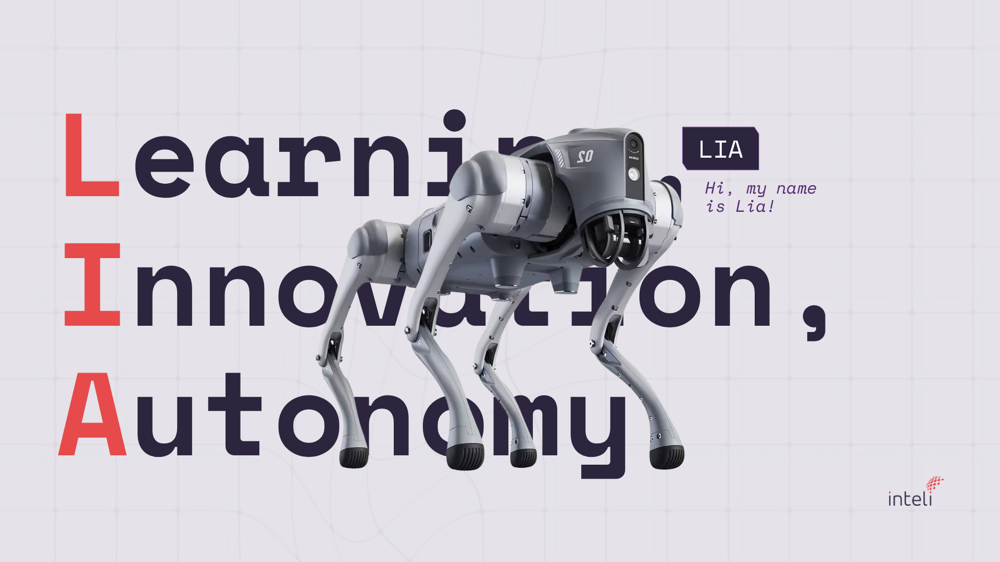

&emsp;Durante o processo de concepção do **cão-robô** que atuará como guia interativo do campus do Inteli, foram exploradas diferentes possibilidades de nomes que refletissem sua personalidade, propósito e vínculo com a identidade institucional.  

&emsp;A escolha do nome é uma etapa essencial de branding, pois define o tom emocional e a forma como o público se conecta com o robô. A seguir, estão apresentados quatro nomes ideados: LIA, Laika, IARA e Chaser. Cada um deles traduz distintos aspectos simbólicos e conceituais do projeto.

---

## **LIA - Learning. Intelligent. Adaptability**

&emsp;O nome LIA representa o arquétipo da inteligência adaptativa. Derivado da sigla de *Learning Intelligent. Adaptability.", simboliza um sistema que aprende com o ambiente e se ajusta a diferentes contextos e públicos. 

&emsp;É um nome curto, sonoro e de fácil memorização, transmitindo empatia, tecnologia e proximidade humana.

### Significados:
- Learning: capacidade de aprendizado contínuo, refletindo a natureza educacional do Inteli.  
- Intelligent: inteligência prática e sensível, conectada à experiência humana.  
- Adaptability: flexibilidade para se ajustar a diferentes tipos de visitantes e situações.  

Figura 1 - LIA

Fonte: Os autores (2025)

&emsp;O nome *LIA* é simbólico para um cão-robô que aprende, observa e interage de maneira fluida e adaptável.

---

## **Laika - O Legado Pioneiro**

&emsp;Inspirado na cadela *Laika*, o primeiro ser vivo a orbitar a Terra em 1957, esse nome evoca o espírito pioneiro e explorador da ciência.  

&emsp;No contexto do projeto, *Laika* simboliza curiosidade, coragem e avanço tecnológico, qualidades que se alinham à proposta do Inteli de formar líderes capazes de romper barreiras e criar o novo.

### Significados:
- Histórico: homenagem à cadela russa que marcou a história da exploração espacial.  
- Simbólico: representa a coragem de ser o primeiro e de abrir caminhos para o futuro.  
- Emocional: desperta empatia e inspiração por sua conexão com a história científica e humana.  

Figura 2 - Laika

Fonte: Os autores (2025)

&emsp;O nome *Laika* posiciona o cão-robô como um símbolo de descoberta e inovação, evocando o arquétipo do **Explorador**, que impulsiona o avanço e inspira novas gerações.

---

## **IARA - Inteligência Autônoma de Reconhecimento e Acolhimento**

&emsp;O nome *IARA* combina tecnologia e brasilidade.  

&emsp;Inspirado na lenda indígena da Iara, a sereia das águas, o nome carrega uma sonoridade suave e acolhedora, representando empatia, sabedoria e conexão com o ambiente.  

&emsp;No contexto técnico, *IARA* é também um acrônimo de **Inteli Autonomous Robotic Assistant**, refletindo o propósito do robô de perceber, compreender e interagir com os visitantes de maneira sensível e acessível.

### Significados:
- Mitológico: figura brasileira associada à harmonia e ao poder da voz.  
- Tecnológico: referência direta à capacidade de percepção e acolhimento inteligente.  
- Simbólico: une raízes culturais com inovação, transmitindo empatia e identidade local.  

Figura 3 - IARA

Fonte: Os autores (2025)

&emsp;O nome *IARA* reforça a identidade brasileira e inclusiva do projeto, equilibrando tecnologia, cultura e empatia, um nome que “fala com as pessoas” de forma calorosa e simbólica.

---

## **Chaser - O Aprendiz Infinito**

&emsp;*Chaser* foi o nome do cão mais inteligente já registrado, capaz de reconhecer mais de mil palavras.  

&emsp;Esse nome carrega o significado de aprendizado ilimitado e memória expandida, conceitos diretamente relacionados à inteligência artificial e à educação contínua.  

&emsp;Simboliza o desejo de aprender, compreender e aperfeiçoar-se. O mesmo propósito do robô e da comunidade acadêmica que o desenvolve.

### Significados:
- Histórico: referência ao Border Collie que redefiniu o entendimento sobre cognição animal.  
- Conceitual: representa a busca incessante pelo conhecimento e pela linguagem.  
- Inspiracional: simboliza a integração entre biologia, ciência e tecnologia.  

Figura 4 - Chaser

Fonte: Os autores (2025)

&emsp;O nome *Chaser* traduz a essência do aprendizado contínuo e da curiosidade aplicada à prática, sendo ideal para um robô educador e pesquisador.

---

## **Conclusão**

&emsp;Os nomes *LIA*, *Laika*, *IARA* e *Chaser* representam diferentes dimensões do projeto do cão-robô do Inteli, abrangendo desde a inteligência adaptativa até a inspiração histórica e cultural.  
&emsp;Cada nome carrega um tom e uma intenção específica:

- **LIA**: inteligência empática e adaptável;  
- **Laika**: espírito pioneiro e explorador;  
- **IARA**: acolhimento e identidade brasileira;  
- **Chaser**: aprendizado contínuo e curiosidade científica.  

&emsp;Essas opções servirão de base para a escolha final do nome oficial, considerando fatores de comunicação, personalidade e identificação com o público.  

&emsp;A definição final buscará equilibrar tecnologia, empatia e simbolismo, assegurando que o nome do cão-robô traduza o propósito do Inteli: unir inovação, humanidade e aprendizado em uma experiência interativa e inspiradora.

---

Figura 5 - Conjunto de Ideações

Fonte: Os autores (2025)

