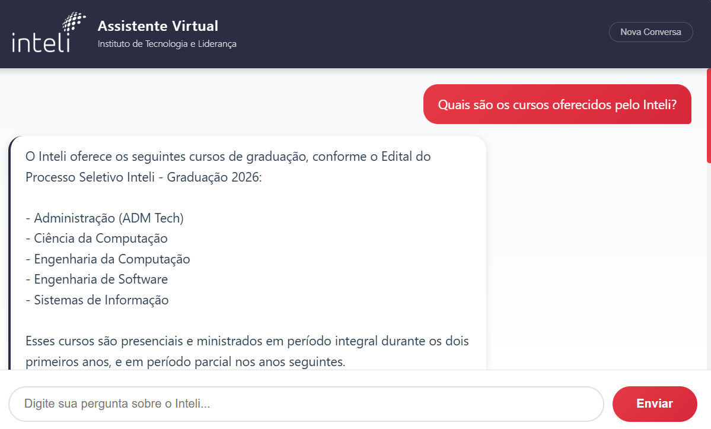

import { Steps } from "fumadocs-ui/components/steps";
import { Callout } from "fumadocs-ui/components/callout";

&emsp;O Chatbot Inteli é um assistente virtual especializado desenvolvido para responder perguntas sobre o Instituto de Tecnologia e Liderança. O sistema utiliza a tecnologia de IA generativa do google (Gemini) para processar consultas e fornecer respostas precisas baseadas em documentos oficiais do instituto.

---

## 1. Visão Geral

### Objetivo

Fornecer um canal de comunicação automatizado e eficiente para estudantes, candidatos e interessados obterem informações sobre cursos, processo seletivo, infraestrutura e outros aspectos do Inteli.

### Características Principais

- Respostas contextualizadas baseadas em documentos oficiais
- Interface web moderna e responsiva
- Foco exclusivo em informações do Inteli
- Processamento de múltiplos documentos PDF

### Interface do Chatbot

<div style={{ textAlign: "center" }}>
  <sup>Figura 1: Interface do Chatbot Inteli</sup>
</div>



<div style={{ textAlign: "center" }}>
  <sub>Fonte: Produzida pelos Autores (2025).</sub>
</div>

---

## 2. Arquitetura do Sistema

O sistema é composto por três camadas principais:

### Camada de Apresentação

Interface web desenvolvida em HTML, CSS e JavaScript vanilla, responsável pela interação com o usuário. Apresenta design responsivo com identidade visual do Inteli.

### Camada de Aplicação

Servidor Flask que gerencia as requisições HTTP, mantém sessões de conversação e orquestra a comunicação com o modelo de IA.

### Camada de Inteligência

Integração com IA generativa (Gemini 2.0 Flash) para processamento de linguagem natural e geração de respostas contextualizadas.

### Fluxo de Dados

```
Usuário -> Interface Web -> Servidor Flask -> Google Gemini API -> Processamento de Contexto -> Resposta -> Interface Web -> Usuário
```

---

## 3. Tecnologias Utilizadas

### Backend

- **Python 3.12**: Linguagem de programação principal
- **Flask 3.0.0**: Framework web para criação do servidor
- **Flask-CORS 4.0.0**: Gerenciamento de políticas de Cross-Origin Resource Sharing
- **Google Generative AI**: SDK para integração com modelos Gemini
- **Python-dotenv 1.0.0**: Gerenciamento de variáveis de ambiente

### Processamento de Documentos

- **PyPDF2 3.0.1**: Biblioteca para extração de texto de arquivos PDF

### Frontend

- **HTML5**: Estrutura da interface
- **CSS3**: Estilização e design responsivo
- **JavaScript ES6**: Interatividade e comunicação com API

### Infraestrutura

- **Google Gemini 2.0 Flash**: Modelo de linguagem para geração de respostas
- **Ambiente Virtual Python**: Isolamento de dependências

---

## 4. Configuração e Instalação

### Pré-requisitos

- Python 3.12 ou superior
- Conta Google Cloud com acesso ao Gemini API
- Navegador web moderno (Chrome, Firefox, Edge, Safari)

<Steps>
### 1. Clonar o Repositório

```bash
git clone https://github.com/GabrielMartinsAlves/test-adk.git
cd test-adk
```

### 2. Criar Ambiente Virtual

```bash
python -m venv venv
```

### 3. Ativar Ambiente Virtual

**Windows (PowerShell):**

```bash
.\venv\Scripts\Activate.ps1
```

**Linux/Mac:**

```bash
source venv/bin/activate
```

### 4. Instalar Dependências

```bash
pip install -r requirements.txt
```

### 5. Configurar Variáveis de Ambiente

Crie um arquivo `.env` na raiz do projeto:

```bash
GOOGLE_API_KEY=sua_chave_api_aqui
```

Para obter uma API key do Google Gemini, acesse: https://makersuite.google.com/app/apikey

### 6. Processar Documentos

Execute o script de processamento de PDFs para extrair o contexto:

```bash
python process_pdfs.py
```

Este comando irá:

- Ler os arquivos PDF na pasta raiz
- Extrair todo o texto dos documentos
- Limpar e formatar o conteúdo
- Salvar o contexto em `inteli_context.txt`

### 7. Iniciar o Servidor

```bash
python app.py
```

O servidor estará disponível em: http://localhost:5000

</Steps>

---

## 5. Estrutura do Projeto

```
test-adk/
│
├── app.py                              # Servidor Flask e lógica principal
├── process_pdfs.py                     # Script de processamento de PDFs
├── requirements.txt                    # Dependências do projeto
├── .env                                # Variáveis de ambiente (não versionado)
├── .env.example                        # Exemplo de configuração
├── .gitignore                          # Arquivos ignorados pelo Git
├── README.md                           # Documentação básica
├── DOCUMENTATION.md                    # Documentação completa (este arquivo)
│
├── templates/
│   └── index.html                      # Interface web do chatbot
│
├── static/
│   ├── logo-inteli-3-768x420-1.png    # Logo do Inteli
│   └── inteli-logo.svg                 # Logo vetorial (alternativa)
│
├── Livro_Inteli_PDF_distribuicao.pdf  # Documento fonte 1
├── Edital-Processo-Seletivo-Inteli_-Graduacao-2026_AJUSTADO.pdf  # Documento fonte 2
│
└── inteli_context.txt                  # Contexto extraído dos PDFs (gerado)
```

---

## 6. Funcionalidades

### 1. Processamento de Documentos

O sistema processa automaticamente documentos PDF para criar uma base de conhecimento para a IA. O processo inclui:

- Extração de texto página por página
- Limpeza de caracteres especiais e formatação
- Remoção de espaços e quebras de linha excessivas
- Concatenação de múltiplos documentos com identificação da fonte

### 2. Gerenciamento de Sessões

Cada usuário possui uma sessão única identificada por timestamp, permitindo:

- Manutenção do histórico de conversação
- Contexto contínuo durante toda a interação
- Isolamento entre diferentes usuários
- Capacidade de resetar a conversa

### 3. Respostas Contextualizadas

O chatbot utiliza todo o contexto extraído dos documentos para:

- Fornecer respostas precisas e detalhadas
- Citar informações específicas dos documentos
- Manter consistência com fontes oficiais
- Recusar perguntas fora do escopo do Inteli

### 4. Interface Responsiva

A interface se adapta a diferentes tamanhos de tela:

- Design mobile-first
- Elementos interativos otimizados para touch
- Layout que se ajusta automaticamente
- Experiência consistente em todos os dispositivos

### 5. Validação de Escopo

Sistema inteligente que:

- Identifica se a pergunta é sobre o Inteli
- Rejeita educadamente consultas fora do escopo
- Mantém o foco nas informações institucionais
- Orienta o usuário sobre tópicos disponíveis

---

## 7. Processamento de Documentos

### Arquivos Processados

O sistema processa os seguintes documentos oficiais:

1. **Livro_Inteli_PDF_distribuicao.pdf**: Documento institucional com informações gerais sobre o Inteli
2. **Edital-Processo-Seletivo-Inteli\_-Graduacao-2026_AJUSTADO.pdf**: Edital oficial do processo seletivo

### Algoritmo de Extração

```python
def extract_text_from_pdf(pdf_path):
    """
    Extrai texto de arquivo PDF usando PyPDF2

    Processo:
    1. Abre o arquivo em modo binário
    2. Cria leitor PDF
    3. Itera por todas as páginas
    4. Extrai texto de cada página
    5. Concatena com quebras de linha
    """
```

### Limpeza de Dados

O processo de limpeza remove:

- Múltiplas quebras de linha consecutivas (reduzidas para duas)
- Espaços duplicados ou excessivos
- Caracteres de controle desnecessários
- Espaços em branco no início e fim

### Armazenamento

O contexto processado é salvo em arquivo de texto plano (`inteli_context.txt`) para:

- Rápido carregamento na inicialização
- Facilitar debugging e validação
- Permitir atualizações incrementais
- Reduzir processamento repetitivo

---

## 8. API e Endpoints

### 1. GET /

**Descrição**: Renderiza a página principal do chatbot

**Resposta**: HTML da interface web

**Código de Status**: 200 OK

### 2. POST /chat

**Descrição**: Processa mensagens do usuário e retorna respostas do chatbot

**Request Body**:

```json
{
  "message": "Quais são os cursos oferecidos pelo Inteli?",
  "session_id": "session_1699123456789"
}
```

**Response**:

```json
{
  "response": "O Inteli oferece os seguintes cursos...",
  "session_id": "session_1699123456789"
}
```

**Códigos de Status**:

- 200: Sucesso
- 400: Mensagem vazia
- 500: Erro no processamento

### 3. POST /reset

**Descrição**: Reseta a conversa de uma sessão específica

**Request Body**:

```json
{
  "session_id": "session_1699123456789"
}
```

**Response**:

```json
{
  "message": "Conversa resetada com sucesso"
}
```

**Códigos de Status**:

- 200: Sucesso
- 500: Erro no processamento

### 4. GET /health

**Descrição**: Verifica o status do servidor e contexto carregado

**Response**:

```json
{
  "status": "ok",
  "context_loaded": true,
  "context_size": 125000
}
```

**Códigos de Status**: 200 OK

---

## 9. Interface do Usuário

### Design System

#### Paleta de Cores

- **Azul Escuro**: #2B2D42 (background do cabeçalho)
- **Vermelho Inteli**: #E63946 (elementos interativos)
- **Cinza Claro**: #f8f9fa (background do chat)
- **Branco**: #ffffff (mensagens do bot)
- **Texto**: #2c3e50 (conteúdo principal)

#### Tipografia

- **Fonte Principal**: Segoe UI, Tahoma, Geneva, Verdana, sans-serif
- **Tamanho Base**: 15px
- **Line Height**: 1.6 (para melhor legibilidade)
- **Espaçamento de Letras**: 0.5px (títulos)

\*obs: isso não consta no BrandBook mas que será autorizado na próxima sprint

### Componentes

#### 1. Cabeçalho

Contém logo do Inteli, título do assistente e botão de nova conversa (visível após primeira mensagem).

**Características**:

- Background azul escuro
- Logo branca com filtro CSS
- Informações institucionais
- Botão discreto de reset

#### 2. Área de Mensagens

Exibe histórico da conversa com scroll automático.

**Características**:

- Background com gradiente sutil
- Mensagens do usuário alinhadas à direita (vermelho)
- Mensagens do bot alinhadas à esquerda (branco com borda azul)
- Animação de fade-in ao adicionar mensagens

#### 3. Indicador de Digitação

Animação visual enquanto o bot processa a resposta.

**Características**:

- Três pontos pulsantes
- Cor azul escuro
- Animação sincronizada
- Aparece apenas durante processamento

#### 4. Chips de Sugestão

Botões de exemplo para iniciar conversação.

**Características**:

- Borda vermelha
- Hover com preenchimento vermelho
- Texto clicável
- Desaparecem após primeira interação

---

## Sistema de Prompts

### Estrutura do Prompt do Sistema

O prompt do sistema é construído dinamicamente e contém:

#### 1. Identificação e Papel

Define o chatbot como assistente especializado no Inteli.

#### 2. Instruções Obrigatórias

```
1. Responder APENAS perguntas sobre o Inteli
2. Buscar resposta no contexto fornecido
3. Usar informações relevantes do contexto
4. Citar detalhes específicos
5. Recusar perguntas fora do escopo
6. Não usar emojis
7. Ser claro, objetivo e amigável
```

#### 3. Formatação de Respostas

Diretrizes para formatação consistente:

- Uso de parágrafos para organizar ideias
- Listas com travessões e quebras de linha
- Linha em branco antes de listas
- Exemplo de formatação incluído no prompt

#### 4. Contexto Completo

Todo o conteúdo extraído dos PDFs é incluído no prompt, permitindo:

- Acesso a informações detalhadas
- Respostas precisas e verificáveis
- Consistência com documentos oficiais

#### 5. Instrução Final

Reforça o uso do português brasileiro e exclusividade do contexto fornecido.

### Configuração do Modelo

```python
generation_config = {
    "temperature": 0.7,        # Balanceamento entre criatividade e precisão
    "top_p": 0.95,             # Núcleo de probabilidade para diversidade
    "top_k": 40,               # Número de tokens considerados
    "max_output_tokens": 2048  # Limite de tokens na resposta
}
```

### Configurações de Segurança

Filtros aplicados para bloquear conteúdo inadequado:

- Assédio: BLOCK_MEDIUM_AND_ABOVE
- Discurso de ódio: BLOCK_MEDIUM_AND_ABOVE
- Conteúdo sexual explícito: BLOCK_MEDIUM_AND_ABOVE
- Conteúdo perigoso: BLOCK_MEDIUM_AND_ABOVE

---

## Exemplo de Uso

### Cenário: Consulta sobre Cursos Oferecidos

#### Interação Completa

**Usuário**: Quais são os cursos oferecidos pelo Inteli?

**Chatbot**: O Inteli oferece os seguintes cursos de graduação, conforme o Edital do Processo Seletivo Inteli - Graduação 2026:

- Administração (ADM Tech)
- Ciência da Computação
- Engenharia da Computação
- Engenharia de Software
- Sistemas de Informação

Esses cursos são presenciais e ministrados em período integral durante os dois primeiros anos, e em período parcial nos anos seguintes.

### Análise da Resposta

#### Elementos Presentes

1. **Contextualização**: Menciona a fonte da informação (Edital)
2. **Formatação Clara**: Lista organizada com travessões
3. **Informações Completas**: Nome completo dos cursos
4. **Detalhes Adicionais**: Informação sobre modalidade e período

#### Fluxo Técnico

```
1. Usuário digita pergunta no input
2. JavaScript captura evento de envio
3. Mensagem enviada via POST /chat
4. Flask recebe e valida a mensagem
5. Verifica/cria sessão do usuário
6. Primeira mensagem: envia contexto do sistema
7. Envia pergunta do usuário ao Gemini
8. Gemini processa com contexto completo
9. Resposta retornada ao Flask
10. Flask formata JSON de resposta
11. JavaScript recebe e renderiza mensagem
12. Scroll automático para última mensagem
13. Botão "Nova Conversa" torna-se visível
```

### Outros Exemplos de Uso

#### Pergunta sobre Processo Seletivo

**Pergunta**: Como funciona o processo seletivo?

**Tipo de Resposta Esperada**: Informações sobre etapas, datas, requisitos e critérios de avaliação baseados no edital.

#### Pergunta sobre Infraestrutura

**Pergunta**: Qual é a infraestrutura do Inteli?

**Tipo de Resposta Esperada**: Descrição das instalações, laboratórios, espaços de convivência e recursos tecnológicos.

#### Pergunta Fora do Escopo

**Pergunta**: Qual é a capital da França?

**Resposta Esperada**: "Desculpe, sou especializado apenas em informações sobre o Inteli."

### Segurança

#### Boas Práticas Implementadas

1. **Variáveis de Ambiente**: API keys não versionadas
2. **CORS Configurado**: Controle de origens permitidas
3. **Validação de Input**: Verificação de mensagens vazias
4. **Rate Limiting**: Considerar implementação para produção

---

## Conclusão

Este chatbot representa uma solução completa e profissional para fornecer informações sobre o Inteli. A arquitetura modular permite fácil manutenção e extensão, enquanto a integração com Google Gemini garante respostas de alta qualidade baseadas em fontes oficiais.
