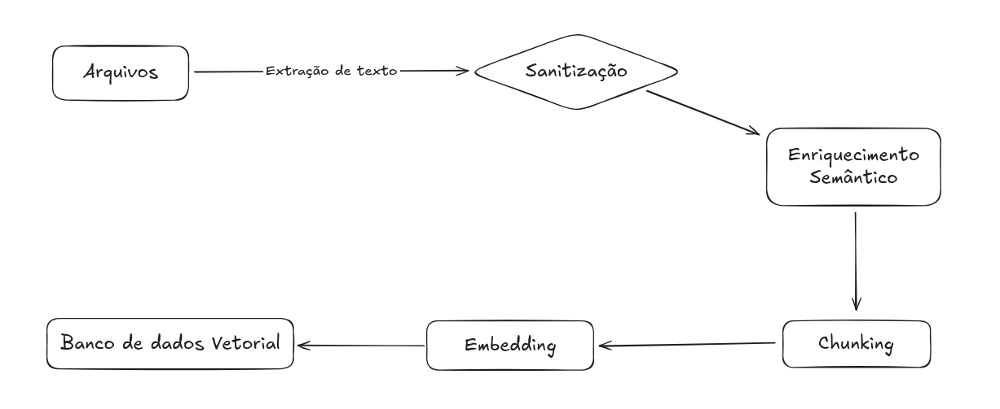

# Pipeline de Ingestão de Arquivos

## Introdução

O pipeline de ingestão de dados foi construído para processar, vetorializar e armazenar documentos institucionais do Inteli em um banco de dados vetorial.

A motivação para este pipeline vem da necessidade de alimentar a IA do robô com **conhecimento institucional confiável**: informações sobre os cursos, processo seletivo, estrutura acadêmica, bolsas, entre outros. Isso permitirá que o robô responda **perguntas com base nos próprios documentos do Inteli**, de forma contextualizada e segura.

---

## Estrutura Geral do Pipeline

:::note

Todas as etapas abaixo estão implementadas com foco em processar arquivos `.pdf` de forma precisa, limpa e segmentada para embeddings.

:::

### 1. Extração dos textos

```python
from unstructured.partition.pdf import partition_pdf

elements = partition_pdf(filename=pdf_path, strategy="fast", ocr_languages="por")
```

- Usa o módulo unstructured para extrair elementos estruturados (parágrafos, títulos, listas etc.).

- Permite detectar metadados como número de página e tipo de elemento (Title, ListItem, etc).

---

### 2. Sanitização dos textos

```python
def clean_text(text):
    text = re.sub(r'\s+', ' ', text)
    text = text.replace('\ufb01', 'fi')
    ...
```

- Remove espaços duplicados, caracteres invisíveis ou corrompidos (ex: \ufb01).

- Elimina repetições de símbolos e rodapés com Pág. ou bullets irrelevantes.

---

### 3. Enriquecimento semântico

```python
def extract_enhanced_metadata(element):
    return {
        'element_id': ...,
        'element_type': ...,
        'page_number': ...,
        'hierarchy_level': ...,
        'section': ...,
    }
```

- Cada trecho extraído é mapeado com contexto de seção, subseção, tipo, número da página e nível hierárquico.

- Isso ajuda a preservar a estrutura semântica do documento original.

---

### 4. Divisão em chunks com sobreposição

```python
RecursiveCharacterTextSplitter(
  chunk_size=500,
  chunk_overlap=100,
)
```

- Os textos são divididos em blocos de até 500 caracteres, com 100 de sobreposição.

- Mantém coesão semântica mesmo em respostas curtas.

<Callout title="Importante">
  {" "}
  Essa segmentação garante que as perguntas do usuário encontrem respostas
  dentro de um mesmo chunk.{" "}
</Callout>

---

### 5. Geração de embeddings

```python
model = SentenceTransformer('sentence-transformers/all-MiniLM-L6-v2')
embeddings = model.encode(texts, ...)
```

- Utiliza modelo pré-treinado da HuggingFace.

- Cada chunk vira um vetor numérico que será armazenado no banco vetorial.

- Embeddings são normalizados e possuem metadados do chunk.

---

### 6. Inserção no banco vetorial (ETAPA: Persistência)

```python
chunks_with_embeddings.append({
  'id': 'chunk_x',
  'content': ...,
  'embedding': [...],
  'metadata': {...}
})
```

Cada embedding é armazenado com:

- ID único

- Conteúdo do chunk

- Vetor (lista de floats)

- Modelo utilizado

- Dados estruturados (página, seção, tipo)

---

## Diagrama do Pipeline

Abaixo você pode inserir o diagrama completo do fluxo de ingestão dos documentos usando MermaidJS ou uma imagem externa.

<p style={{ textAlign: "center" }}>Figura 1 - Pipeline de arquivos</p>



<p style={{ textAlign: "center" }}>Fonte: Os autores (2025)</p>

---

## Conclusão

A implementação deste pipeline possibilita o uso inteligente e contextualizado de documentos institucionais do Inteli por meio de IA generativa baseada em conhecimento vetorial. Essa estrutura é fundamental para o sucesso do robô de tours do projeto, pois garante que ele responderá dúvidas com conteúdo oficial, preciso e atualizado.

É essencial que os documentos utilizados sejam sempre os mais recentes e oficiais, para evitar inconsistências nas respostas.

<Callout title="Próximos Passos" type="info">
  {" "}
  Integração com o agente conversacional do robô e testes de consulta em
  linguagem natural usando os embeddings gerados.{" "}
</Callout>
