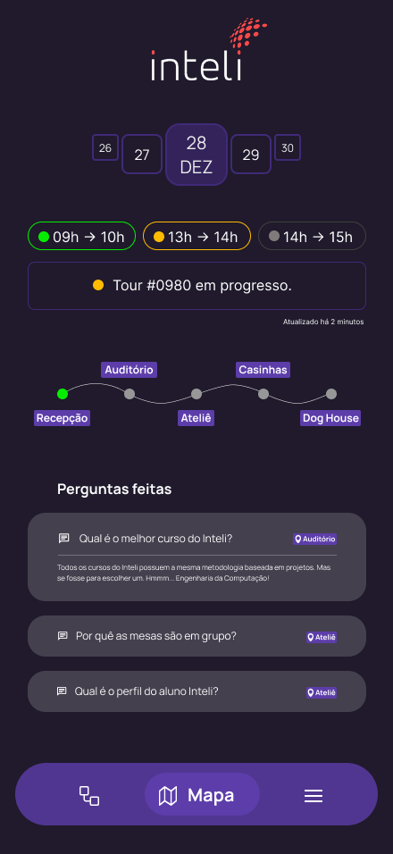
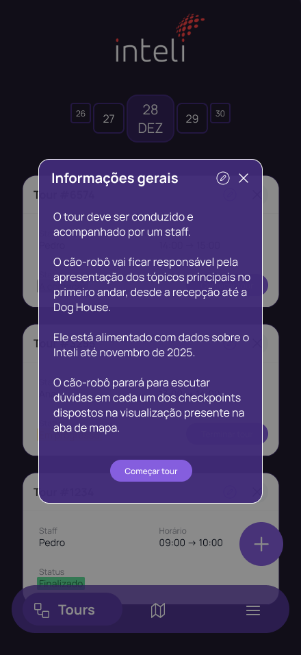

# Protótipo de Alta Fidelidade — Aplicativo do Staff

O aplicativo do Staff foi desenvolvido para apoiar os colaboradores responsáveis pelos tours guiados realizados no campus do Inteli. Por meio dele, os funcionários podem criar, visualizar e gerenciar tours, acompanhar o progresso da visitação, acessar o mapa detalhado do campus e disponibilizar o código de acesso aos visitantes.

---

# Telas do Aplicativo

## 1. Tela de Login

Figura 1 — Tela de Login

### Resumo
Tela inicial utilizada para entrada no aplicativo por parte dos funcionários.

### Funcionalidades
- Exibição do nome do colaborador identificado.
- Botão **Entrar** para acesso ao painel principal.

### Objetivo
Garantir que apenas colaboradores autorizados gerenciem tours dentro do campus.

---

## 2. Tela de Lista de Tours

Figura 2 — Tela de Lista de Tours

### Resumo
Tela principal do aplicativo, apresentando todos os tours cadastrados para a data selecionada.

### Informações exibidas
- Horário do tour.
- Nome do responsável/convidado.
- Duração prevista.
- Botões para **consultar** ou **iniciar** o tour.

### Funcionalidades
- Seleção de data para navegar entre dias.
- Troca de dias da semana usando botões de navegação.
- Início do tour diretamente pela lista.

### Objetivo
Organizar e facilitar o gerenciamento diário dos tours.

---

## 3. Tela de Edição do Tour

Figura 3 — Tela de Edição de Tour

### Resumo
Tela usada para visualizar e editar informações detalhadas de um tour específico.

### Informações exibidas
- Data e horário.
- Nome do responsável.
- Setor/área de destino.
- Lista de visitantes cadastrados.

### Funcionalidades
- Adicionar novos visitantes.
- Remover visitantes existentes.
- Editar informações principais do tour.
- Criar um novo tour a partir do botão flutuante.

### Objetivo
Permitir ajustes ágeis antes ou durante o andamento do tour.

---

## 4. Tela do Mapa e Progresso

Figura 4 — Tela de Mapa

### Resumo
Tela que permite aos colaboradores acompanhar o progresso do tour e visualizar a localização do robô.

### Funcionalidades
- Mapa do campus com rota do tour.
- Indicação da etapa atual.
- Histórico de perguntas feitas pelos visitantes.

### Objetivo
Garantir supervisão do progresso do tour e orientar o staff sobre o ritmo da visita.

---

## 5. Tela de Menu

Figura 5 — Tela de Menu

### Resumo
Seção de navegação para configurações e gestão da conta.

### Opções disponíveis
- Perfil do usuário.
- Configurações gerais.
- Sair do aplicativo.

### Objetivo
Oferecer área central de ajustes e gerenciamento da sessão.

---

## 6. Tela de Informações Gerais do Tour

Figura 6 — Informações Gerais

### Resumo
Tela apresentada para reforço de orientações antes do início do tour.

### Conteúdo abordado
- Segurança dos visitantes.
- Acompanhamento do robô.
- Procedimentos caso haja intercorrências.

### Objetivo
Garantir alinhamento entre o staff antes da condução da experiência.

---

## 7. Tela de Código do Tour

Figura 7 — Código do Tour

### Resumo
Tela que exibe o código destinado aos visitantes para entrar no tour pelo aplicativo visitante.

### Funcionalidades
- Exibir código único gerado automaticamente.
- Botão para confirmar início do tour.
- Informação sobre como compartilhar o código com o visitante.

### Objetivo
Conectar visitantes ao tour correto e garantir sincronização entre dispositivos.

---

# Mecanismos de Navegação

### Fluxo Automático
| Evento | Tela apresentada |
|-------|------------------|
| Abrir o app | Login |
| Login bem-sucedido | Lista de Tours |
| Selecionar Tour | Edição do Tour |
| Iniciar Tour | Código do Tour → Mapa |

### Acesso Permanente via Menu
- Perfil
- Configurações
- Sair

---

# Conclusão

O protótipo de alta fidelidade documentado neste projeto representa a estrutura visual e funcional do Aplicativo do Staff. Ele define o fluxo de trabalho, interações essenciais e suporte necessário para a condução segura, organizada e eficiente dos tours guiados pelo robô dentro do campus.

---
