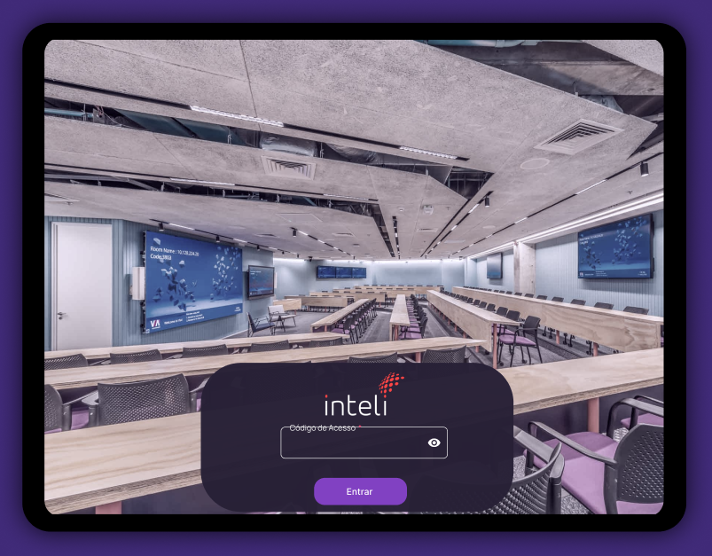

# Documentação do Protótipo de Alta Fidelidade — Aplicativo do Visitante

## Introdução

O aplicativo do visitante foi desenvolvido para apoiar a experiência de pais, filhos e demais convidados que participam do tour guiado pelo robô-cachorro LIA durante visitas à faculdade Inteli. O objetivo deste aplicativo é garantir uma jornada educativa, segura e interativa, permitindo que o visitante acompanhe o tour, faça perguntas ao robô, visualize o mapa da instituição em tempo real e mantenha total controle sobre sua experiência.
Durante o tour, a LIA conduz os visitantes por etapas específicas da faculdade, pausando ao final de cada fase para interagir e responder perguntas. O aplicativo serve como um intermediário entre o visitante e o robô, permitindo envio de mensagens por voz, visualização do que o robô está falando e controle sobre o progresso do tour.
Além disso, por ser utilizado apenas em dispositivos autorizados pela instituição, o app garante segurança operacional e integração confiável com a LIA.

---

## O que é um Protótipo de Alta Fidelidade

O protótipo de alta fidelidade é uma versão visual detalhada da interface final do aplicativo. Ele simula com alta precisão a estética, hierarquia visual, layouts, interações e fluxos completos entre telas — mas sem necessariamente contar com a funcionalidade real.

Esse tipo de protótipo permite:

- Testar a experiência do usuário com realismo.
- Validar o design junto a stakeholders.
- Refinar interações e fluxos antes do desenvolvimento.
- Finalizar decisões visuais como cores, tipografia e ícones.

O protótipo documenta todas as telas presentes no fluxo do visitante e descreve como cada uma é acionada no contexto da jornada.

---

# Telas do Aplicativo

A seguir, cada tela presente no protótipo é descrita com seu propósito, conteúdo e momento de acionamento.

---

## Tela Inicial

  Figura 1 - Tela de Login com Código do Tour Versão 1

Fonte: Os autores (2025)

  Figura 2 - Tela de Login com Código do Tour Versão 2

Fonte: Os autores (2025)

  Figura 3 - Tela de Login com Código do Tour Versão 3

Fonte: Os autores (2025)

### Resumo
A primeira tela apresentada assim que o tablet é ligado e o aplicativo é iniciado.

### Funcionalidades
- Campo para inserção do código do tour, recebido pelo visitante.
- Botão de confirmação.

### Objetivo
Validar a entrada do visitante, associando-o ao tour correto e permitindo o início da experiência guiada pela LIA.

---

## Tutorial 1 — Botão de Emergência

  Figura 4 - Tutorial Botão de Emergência

Fonte: Os autores (2025)

### Resumo
Primeira tela da sequência de tutoriais, exibida logo após inserir o código do tour, em formato de pop-up.

### Funcionalidade e objetivo
- Informa o visitante sobre o botão de emergência, localizado na interface.
- Explica que acionar o botão solicitará ajuda dos funcionários do Inteli.

---

## Tutorial 2 — Distância Segura do Robô

  Figura 5 - Tutorial Distância Segura do Robô

Fonte: Os autores (2025)

### Resumo
Tela de tutorial explicando precauções físicas.

### Informações
- O visitante deve manter pelo menos 2 metros de distância da LIA.
- Garanta segurança e operação adequada da navegação robótica.

---

## Tutorial 3 — Perguntas ao Final de Cada Etapa

  Figura 6 - Tutorial Perguntas ao Final de Cada Etapa

Fonte: Os autores (2025)

### Resumo
Instruções sobre a etapa interativa do tour.

### Detalhes
- O robô responderá perguntas ao final de cada etapa do percurso.
- Essa interação ocorrerá através da tela de chat.

---

## Tutorial 4 — Confirmação para Continuar Tour

  Figura 7 - Tutorial Confirmação para Continuar Tour

Fonte: Os autores (2025)

### Resumo
Explica ao visitante como o tour avança.

### Detalhes
- Ao final de cada fase do tour, o app exibirá uma tela pop-up perguntando se o visitante deseja continuar.

---

## Tela de Chat

  Figura 8 - Tela de Chat - Envio de dúvida

Fonte: Os autores (2025)

  Figura 9 - Tela de Chat - Recebimento de resposta

Fonte: Os autores (2025)

### Resumo
Espaço principal de interação entre visitante e a LIA.

### Funcionalidades
- Enviar perguntas por voz ao robô.
- A LIA responde por voz simultaneamente.
- As respostas aparecem também em formato textual, como em um chat convencional.
- Exibe cada mensagem como se fosse uma conversa tipo WhatsApp.

### Acesso
- Ícone do microfone na navbar, disponível durante todo o tour.

---

## Tela de Prosseguir

  Figura 10 - Tela de Prosseguir

Fonte: Os autores (2025)

### Resumo
Tela exibida em formato de pop-up ao final de cada etapa.

### Funcionalidades
- Pergunta ao visitante: “Deseja prosseguir para a próxima etapa?”
- Interrompe o fluxo até confirmação do visitante.

---

## Tela de Emergência

  Figura 11 - Tela de Emergência

Fonte: Os autores (2025)

### Resumo
Tela crítica para acionamento de suporte imediato.

### Funcionalidades
- Botão principal para solicitar assistência.
- Interrompe o tour completamente.
- Funcionários do Inteli são notificados.

### Acesso
- Ícone de sirene na navbar.

---

## Tela do Mapa

  Figura 11 - Tela do Mapa

Fonte: Os autores (2025)

### Resumo
Visualização espacial da navegação da LIA.

### Funcionalidades
- Mostrar o campus do Inteli.
- Indicar a posição atual do robô no mapa.
- Atualização em tempo real conforme o tour acontece.

### Acesso
- Ícone de mapa na navbar.

---

# Mecanismos de Acesso às Telas

### Exibidas automaticamente
- Inicial → ao abrir o app.
- Tutoriais → após inserir o código.
- Prosseguir → após a LIA finalizar cada etapa do tour.

### Exibidas manualmente
Via navbar:
- Chat (microfone)
- Emergência (sirene)
- Mapa (pin/mapa)

---

# Conclusão

O protótipo de alta fidelidade documentado aqui representa a versão visual final do aplicativo do visitante. Ele estabelece como será a experiência completa, desde a chegada do usuário ao tour até sua interação com a LIA e a navegação pelas informações exibidas. Esta documentação serve como referência para designers, desenvolvedores e avaliadores durante a construção oficial do aplicativo.
