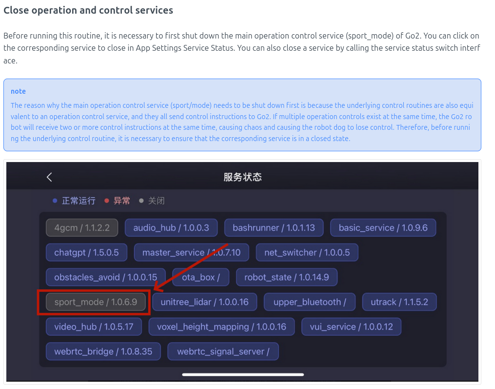

# Sprint 2 – Exploração e Integração com WebRTC

## Objetivos Principais

- Estabelecer comunicação estável com o robô via WebRTC.
- Validar movimentações nos eixos X, Y e Z.
- Compreender e aplicar parâmetros corretos de velocidade e rotação.
- Criar abstração de código e leitura via JSON.
- Testar tópicos adicionais como `OBSTACLES_AVOID`.

---

## Atividades Realizadas na semana 3

### Primeiros testes com WebRTC

- Fizemos a implementação inicial do WebRTC com sucesso nas primeiras movimentações.

#### Exemplo de Requisição via WebRTC

```python title="Exemplo de requisição WebRTC para movimentação"
await conn.datachannel.pub_sub.publish_request_new(
    RTC_TOPIC["SPORT_MOD"],
    {
        "api_id": SPORT_CMD["Move"],
        "parameter": {"x": 1, "y": 0, "z": 0}
    }
)
```

- Testes manuais dos eixos:
  - X = 1 → movimentação de 1 metro
  - Y = 1 → movimentação de 0,5 metro
  - Z = 1 → rotação de 90°

- Direções observadas durante os testes:
  - X > 0: frente | X < 0: trás
  - Y, Z > 0: direita | Y, Z < 0: esquerda

### Testes no térreo

- Testamos o robô no térreo para validarmos em trajetórias mais longas.
- Problemas encontrados:
  - Identificamos que as distâncias percorridas eram constantes, independentemente do valor de X e Y.
  - O robô se movimenta em velocidades excessivas quando aumentamos os valores de X e Y.
- Tentamos ajustar a velocidade via tópico `SpeedLevel`, mas não tivemos nenhum sucesso devido à falta de documentação.

### Pesquisa e descoberta

- Estudamos a arquitetura do sistema e identificamos os fluxos de comunicação.

<p style={{ textAlign: "center" }}>
  Figura 1 - Arquitetura Unitree Go2
</p>


<p style={{ textAlign: "center" }}>Fonte: [support.unitree](https://support.unitree.com/home/en/developer/Architecture%20Description)</p>


<p style={{ textAlign: "center" }}>
  Figura 2 - Arquitetura de hardware Unitree Go2
</p>


<p style={{ textAlign: "center" }}>Fonte: [support.unitree](https://support.unitree.com/home/en/developer/about_Go2)</p>

- Descobrimos que o modo `Sport Mode` precisa estar desativado para o SDK operar.

<p style={{ textAlign: "center" }}>
  Figura 3 - SportMode
</p>



<p style={{ textAlign: "center" }}>Fonte: [support.unitree](https://support.unitree.com/home/en/developer/Quick_start)</p>

- Descoberta de documentação técnica do SDK (com parâmetros e APIs idênticas ao WebRTC):
  - [Motion Services Interface V2.0](https://support.unitree.com/home/en/developer/Motion_Services_Interface_V2.0)
- Descobrimos que os parâmetros X, Y e Z esperam receber valores de velocidade em metros por segundo (m/s) e que todas as requisições enviadas para o robô duram apenas um segundo.
- Sendo assim, precisamos enviar a mesma requisição durante mais tempo caso precisemos de movimentações mais longas.

:::note

Após uma conversa com o professor Nicola, constatamos que o WebRTC é uma engenharia reversa do SDK, portanto, é possível utilizar os mesmos parâmetros descritos na documentação oficial.

:::

### Aplicação e calibração

- Após as descobertas fizemos a implementação dos parâmetros descobertos.
- A movimentação foi bem-sucedida e o robô se movimenta em múltiplas distâncias
- Testamos com waypoints múltiplos e conseguimos validar a movimentação encadeada.

### Abstração e leitura dinâmica

- Resolvemos criar uma camada de abstração para comunicação com o robô, permitindo colocarmos a distância em metros ao invés de metros por segundo.
- Também resolvemos implementar a leitura de waypoints via JSON.
- Código concluído, testes pendentes.

---

## Atividades Realizadas na semana 3

### Apoio ao time de Security

- Colaboração direta com a equipe de Security no uso do LiDAR do robô.
- Auxiliamos na coleta e análise dos dados brutos provenientes do sensor, garantindo que o time conseguisse interpretar corretamente os valores e padrões retornados.
- Nosso foco foi apoiar a equipe na identificação de padrões espaciais (distâncias, ângulos e presença de obstáculos) para que pudessem desenvolver soluções de prevenção de colisões com pessoas ou objetos no ambiente.
- Esse trabalho contribuiu para conectar os dados do sensor à camada de controle do robô, servindo de base para futuras implementações de detecção e desvio automático de obstáculos.

### Testes para evitar colisões

- Utilizando da documentação tentamos enviar uma requisição para um tópico chamado `OBSTACLES_AVOID`
- Testamos os seguintes tópicos:
  - API ID 1001 → Set parameters (True / False) → Habilitamos ou desabilitamos a colisão
  - API ID 1002 → Get current parameter → Verificamos o estado atual da funcionalidade (se está ativa ou não)
- Resultado: o robô ainda colide, sem efeito prático.

---

## Links Relevantes

- [Documentação oficial das funções do SDK (Motion Services Interface V2.0)](https://support.unitree.com/home/en/developer/Motion_Services_Interface_V2.0)
- [Repositório utilizado pelo grupo](https://github.com/DaniloMartinsMerlo/go2_webrtc)

---

## Aprendizados

- O **WebRTC** utiliza os mesmos parâmetros de controle do SDK oficial da Unitree, apenas variando o tópico em que devemos enviar as requisições.
- A calibração prática foi essencial para definir a relação entre valores e deslocamento real.
- Movimentações tornaram-se mais previsíveis e controladas após a aplicação correta dos parâmetros.
- Documentações técnicas do SDK são referências fundamentais mesmo para implementações via WebRTC.

---

## Dificuldades Encontradas

- Ausência de documentação específica do WebRTC.
- Tópico `OBSTACLES_AVOID` sem funcionamento aparente.
- Calibração dependente de testes empíricos.

---

## Próximos Passos

- Finalizar e testar a abstração JSON.
- Explorar alternativas para o `OBSTACLES_AVOID`.
- Integrar movimentação autônoma com múltiplos waypoints.