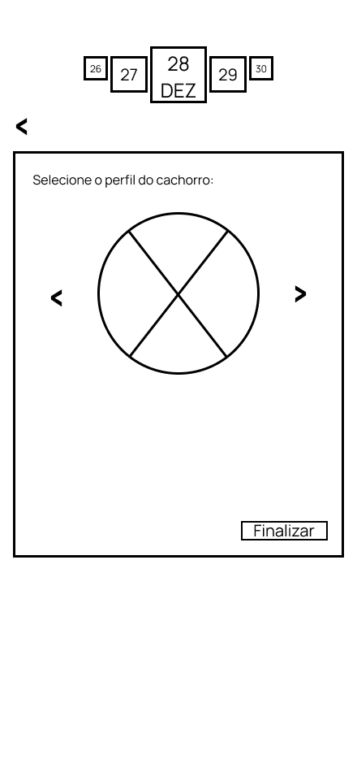

import { Steps } from 'fumadocs-ui/components/steps';

&emsp;Como definido anteriormente, um dos usuários da aplicação será uma pessoa da staff do Inteli. Assim, os principais deveres desse usuário enquanto interage com a aplicação é de **criar, gerenciar e acompanhar os tours** que estão em andamento e também visualizar estatísticas sobre, por exemplo, as perguntas mais comuns que são feitas pelos visitantes, etc.

## 1. Tela de Visão Geral e Agendamentos
Esta é a tela inicial do aplicativo, focada na gestão de tours.

*   **Propósito:** Permitir que o membro da Staff visualize os tours agendados e inicie o processo de criação de um novo tour.
*   **Elementos Chave:**
    *   **Seletor de Data:** Permite filtrar a lista de tours por dia (e.g., 27, 28, 29 DEZ).
    *   **Tabela/Lista de Tours:** Exibe os tours agendados com as colunas **Horário**, **Nome** (do responsável) e **Status** (e.g., Agendado, Em Andamento, Finalizado).
    *   **Botão de Criação (+):** Localizado no canto superior direito, inicia o fluxo de criação de um novo tour.
    *   **Ação de Clique:** Clicar em um tour existente na lista leva à tela de Detalhamento do Tour (Tela 5).

Figura 1 - Tela de Visão Geral e Agendamentos

Fonte: Os autores (2025)

---
## 2. Tela de Cadastro de Visitantes

Esta tela faz parte do fluxo de criação de um novo tour.

*   **Propósito:** Coletar as informações essenciais dos visitantes que participarão do tour.
*   **Elementos Chave:**
    *   **Responsável e Data:** Campos para identificar o responsável pelo agendamento e a data do tour.
    *   **Visitantes:** Campos para **Nome** e **E-mail** do primeiro visitante.
    *   **Adicionar Visitantes:** Opção para incluir mais participantes no tour.
    *   **Botão Confirmar:** Avança para a próxima etapa do fluxo de criação do tour.

Figura 2 - Tela de Cadastro de Visitantes

Fonte: Os autores (2025)

---
## 3. Tela de Seleção de Perfil do Robô

Esta tela é a etapa de personalização do tour.

*   **Propósito:** Definir a personalidade e o modo de interação do cachorro robótico durante o tour.
*   **Elementos Chave:**
    *   **Título:** "Selecione o perfil do cachorro".
    *   **Carrossel de Seleção:** Área central com setas laterais para navegar entre os diferentes perfis/personalidades disponíveis para o robô.
    *   **Botão Finalizar:** Conclui a seleção e avança para a tela de Resumo.

Figura 3 - Tela de Seleção de Perfil do Robô

Fonte: Os autores (2025)

---
## 4. Tela de Resumo e Criação do Tour

Esta tela é o ponto final antes da criação definitiva do tour.

*   **Propósito:** Permitir que o membro da Staff revise todas as informações coletadas (visitantes e perfil do robô) antes de finalizar o agendamento.
*   **Elementos Chave:**
    *   **Título:** "Informações gerais".
    *   **Conteúdo:** Área de texto longo que exibe o resumo dos dados.
    *   **Opção Editar:** Permite retornar às telas anteriores para realizar ajustes.
    *   **Botão Iniciar:** Cria o tour no sistema e o marca como agendado.

Figura 4 - Tela de Resumo e Criação do Tour

Fonte: Os autores (2025)

---
## 5. Tela de Detalhamento e Início do Tour

Esta tela é acessada ao clicar em um tour agendado na Tela 1.

*   **Propósito:** Iniciar um tour agendado e gerar o código de acesso para o visitante.
*   **Fluxo de Ação:**
    1.  O membro da Staff acessa o detalhamento do tour.
    2.  Ao iniciar o tour (ação não visível no wireframe, mas implícita), o sistema gera um **Código do Tour**.
    3.  O código (representado por `******`) é exibido para ser fornecido ao visitante, que o utilizará em seu próprio aplicativo para iniciar a experiência.
    *   **Botão Cancelar:** Permite abortar a operação.

Figura 5 - Tela de Detalhamento e Início do Tour (Geração de Código)

Fonte: Os autores (2025)

---
## 6. Tela de Acompanhamento do Tour

Esta é a tela principal de monitoramento de um tour em andamento.

*   **Propósito:** Fornecer à Staff uma visão em tempo real do progresso do tour e das interações do robô.
*   **Elementos Chave:**
    *   **Status: Em Andamento:** Indica que o tour está ativo.
    *   **Barra de Progresso:** Exibe as etapas do tour/processo (e.g., Arquibancada, Ateliê, Casinhas, etc) e o status de cada uma.
    *   **Perguntas Feitas:** Seção para visualizar as perguntas que foram feitas pelos visitantes ao robô, permitindo a coleta de estatísticas.
    *   **Barra de Navegação Inferior:** Contém as ações de controle do tour:
        *   Ícone de Mapa: Abre a visualização do mapa (Tela 7).
        *   Botão Central (X): **Finalizar Tour**.
        *   Ícone de Parada: **Parar por Emergência**.

Figura 6 - Tela de Acompanhamento do Tour

Fonte: Os autores (2025)

---
## 7. Tela de Mapa do Tour

Esta tela é acessada a partir da Tela 6.

*   **Propósito:** Visualizar a localização atual do robô e o progresso físico do tour.
*   **Elementos Chave:**
    *   **Título:** "MAPA DO INTELI + CHECKPOINTS".
    *   **Área de Mapa:** Exibe o mapa da faculdade com a rota do tour.
    *   **Localização do Robô:** Indica o checkpoint onde o robô se encontra no momento.
    *   **Barra de Navegação Inferior:** Mantém as mesmas opções de controle da Tela 6.

Figura 7 - Tela de Mapa do Tour

Fonte: Os autores (2025)

---

## Fluxo de Uso Principal

<Steps>
### 1. Visualizar Agendamentos
O membro da Staff acessa a **Tela 1** para ver a lista de tours agendados para o dia.

### 2. Criar Novo Tour
A partir da **Tela 1**, o Staff inicia o fluxo de criação, passando pelas **Telas 2** (Cadastro de Visitantes) e **3** (Seleção de Perfil do Robô).

### 3. Confirmar Agendamento
Na **Tela 4** (Resumo), o Staff revisa e confirma o agendamento do tour.

### 4. Iniciar Tour e Gerar Código
No dia do tour, o Staff seleciona o agendamento na **Tela 1** e, após iniciar, é levado à **Tela 5** para obter o código de acesso que será repassado ao visitante.

### 5. Acompanhar o Progresso
Com o tour em andamento, o Staff monitora o progresso na **Tela 6** (Acompanhamento), podendo visualizar o mapa na **Tela 7** e intervir (Finalizar ou Parar por Emergência) quando necessário.
</Steps>