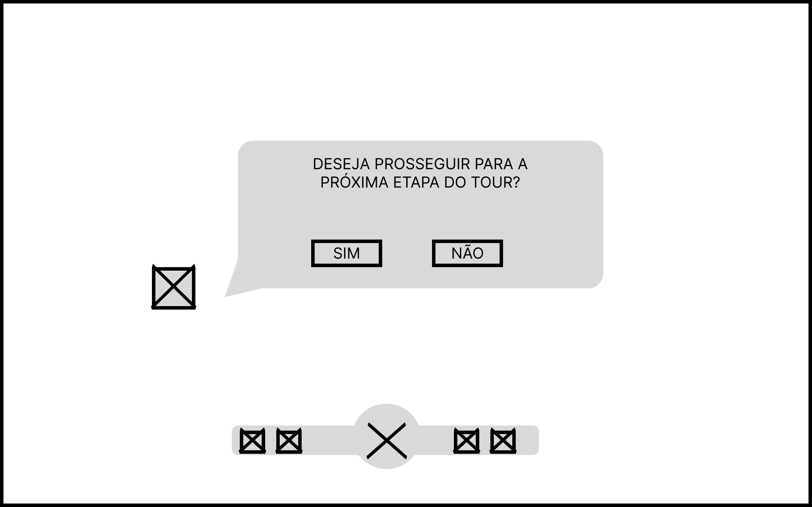

import { Steps } from 'fumadocs-ui/components/steps';

&emsp; Como definido anteriormente, um dos principais usuários da aplicação será o visitante do Inteli. Assim, os principais deveres desse usuário, enquanto interage com a aplicação, são compreender as informações apresentadas e informar dúvidas sobre o Inteli durante o tour.

## 1. Tela de Login com Código
Esta é a tela inicial do aplicativo, que permitirá ao usuário iniciar o tour.

*   **Propósito:** Permitir que o usuário insira um código de acesso disponibilizado pela equipe para que o tour possa ser iniciado.
*   **Elementos-Chave:**
    *   **Campo de Inserção do Código:** Localizado no centro da tela, permite iniciar o tour quando o código correto for inserido.
    *   **Botão "Entrar":** Localizado na parte inferior central, inicia o tour caso o código esteja correto.
    *   **Ação de Clique:** Clicar em "Entrar" inicia o tour e envia o usuário para a tela de Tutorial - Conversa com o Cão Robô (2).

Figura 1 - Tela de Login com Código do Tour

Fonte: Os autores (2025)

---

## 2. Tela de Tutorial - Conversa com o Cão Robô

Esta é a tela inicial do tutorial, que permitirá ao usuário aprender como interagir com o cão robô.

*   **Propósito:** Ensinar o usuário a se comunicar com o robô por meio do chat de voz.
*   **Elementos-Chave:**
    *   **Pop-up Explicativo:** Localizado no centro da tela, explica ao usuário como ele pode se comunicar com o cão robô.
    *   **Botão "OK":** Localizado na parte inferior central do pop-up, envia o usuário para o próximo pop-up do Tutorial - Fluxo do Tour (3).

Figura 2 - Tela de Tutorial - Conversa com o Cão Robô

Fonte: Os autores (2025)

---
## 3. Tela de Tutorial - Fluxo do Tour

Esta é a tela do tutorial que permitirá ao usuário entender como funcionará a dinâmica do tour.

*   **Propósito:** Explicar ao usuário como ele pode passar pelos checkpoints do tour e o que eles representam.
*   **Elementos-Chave:**
    *   **Pop-up Explicativo:** Localizado no centro da tela, explica ao usuário como seguir com o tour.
    *   **Botão "OK":** Localizado na parte inferior central do pop-up, envia o usuário para o próximo pop-up do Tutorial - Botão de Emergência (4).

Figura 3 - Tela de Tutorial - Fluxo do Tour

Fonte: Os autores (2025)

---
## 4. Tela de Tutorial - Botão de Emergência

Esta é a tela do tutorial que permitirá ao usuário entender o que fazer em caso de emergência.

*   **Propósito:** Ensinar o usuário como agir em caso de erro ou bug no sistema do cão robô.
*   **Elementos-Chave:**
    *   **Pop-up Explicativo:** Localizado no centro da tela, explica ao usuário onde ele deve clicar para parar o robô, evitando possíveis danos.
    *   **Botão "OK":** Localizado na parte inferior central do pop-up, envia o usuário para a Tela - Mapa do Inteli (5).

Figura 4 - Tela de Tutorial - Botão de Emergência

Fonte: Os autores (2025)

---
## 5. Tela Mapa do Inteli

Esta é a tela que permitirá ao usuário entender em qual parte do tour ele se encontra.

*   **Propósito:** Permitir que o usuário saiba em qual parte da instituição e em qual etapa do tour ele está no momento.
*   **Elementos-Chave:**
    *   **Mapa Inteli:** Localizado no centro da tela, mostra ao usuário onde ele está e em qual dos checkpoints se encontra ou já passou.
    *   **HUD:** Localizado na parte inferior central da tela, oferece cinco ações possíveis ao usuário, sendo uma delas voltar para esta tela do mapa.
    *   **Botão "Checkpoint":** Localizado no HUD, envia o usuário para a Tela - Prosseguir com o Tour (6).

Figura 5 - Tela Mapa do Inteli

---
## 6. Tela Prosseguir com o Tour

Esta é a tela que permitirá ao usuário continuar o tour ou permanecer parado com o cão robô em um dos checkpoints.

*   **Propósito:** Permitir que o usuário utilize os outros elementos do HUD, como o chat de conversa com o cão robô para fazer perguntas, ou prossiga com o tour.
*   **Elementos-Chave:**
    *   **Pop-up Checkpoint:** Localizado no centro da tela, mostra ao usuário a opção de seguir para o próximo ponto do tour ou permanecer no atual para conversar com o robô.
    *   **HUD:** Localizado na parte inferior central da tela, oferece cinco ações possíveis ao usuário, sendo uma delas voltar para esta tela.
    *   **Botão "Microfone":** Localizado no centro do HUD, envia o usuário para a Tela - Chat com o Cão Robô (7).

Figura 6 - Tela Prosseguir com o Tour

---
## 7. Tela Chat com o Cão Robô

Esta é a tela que permitirá ao usuário conversar com o cão robô para tirar dúvidas.

*   **Propósito:** Permitir que o usuário faça perguntas ao cão robô, que serão respondidas durante as pausas nos checkpoints.
*   **Elementos-Chave:**
    *   **Tela de Conversa:** Localizada no centro da tela, mostra as perguntas feitas pelo usuário e as respostas dadas pelo cão robô.
    *   **HUD:** Localizado na parte inferior central da tela, oferece cinco ações possíveis ao usuário, sendo uma delas voltar para esta.
    *   **Botão "Microfone":** Localizado à direita da tela, permite ao usuário fazer perguntas ao cão robô.
    *   **Botão "Emergência":** Localizado no HUD, permite ao usuário ir até a Tela - Botão de Emergência (8).

Figura 7 - Tela Chat com o Cão Robô

---
## 8. Tela Botão de Emergência

Esta é a tela que permitirá ao usuário parar o robô caso ocorra algum bug.

*   **Propósito:** Permitir que o usuário interrompa todas as ações do robô em caso de emergência.
*   **Elementos-Chave:**
    *   **HUD:** Localizado na parte inferior central da tela, oferece cinco ações possíveis ao usuário, sendo uma delas voltar para esta.
    *   **Botão "Emergência":** Localizado no centro da tela, permite ao usuário parar completamente o cão robô.

Figura 8 - Tela Botão de Emergência

---

## Fluxo de Uso Principal

<Steps>
### 1. Inserir Código de Acesso
O visitante acessa a **Tela 1** (Login com Código) e insere o código fornecido pela equipe do Inteli para iniciar o tour.

### 2. Aprender a Interagir com o Cão Robô
Após o login, o visitante é guiado pelas **Telas 2**, **3** e **4** (Tutoriais) que explicam como conversar com o cão robô, como funcionam os checkpoints e como utilizar o botão de emergência.

### 3. Visualizar o Mapa do Inteli
Concluído o tutorial, o visitante acessa a **Tela 5** (Mapa do Inteli) para ver onde está e acompanhar seu progresso pelos checkpoints do tour.

### 4. Prosseguir com o Tour
Na **Tela 6** (Prosseguir com o Tour), o visitante decide se continua para o próximo ponto do tour ou permanece no atual para conversar com o cão robô.

### 5. Interagir com o Cão Robô
Ao selecionar o botão de microfone, o visitante acessa a **Tela 7** (Chat com o Cão Robô), onde pode fazer perguntas e receber respostas durante as pausas do tour.

### 6. Parar o Robô em Caso de Emergência
Se ocorrer algum problema, o visitante pode acessar a **Tela 8** (Botão de Emergência) para interromper imediatamente as ações do cão robô.
</Steps>
