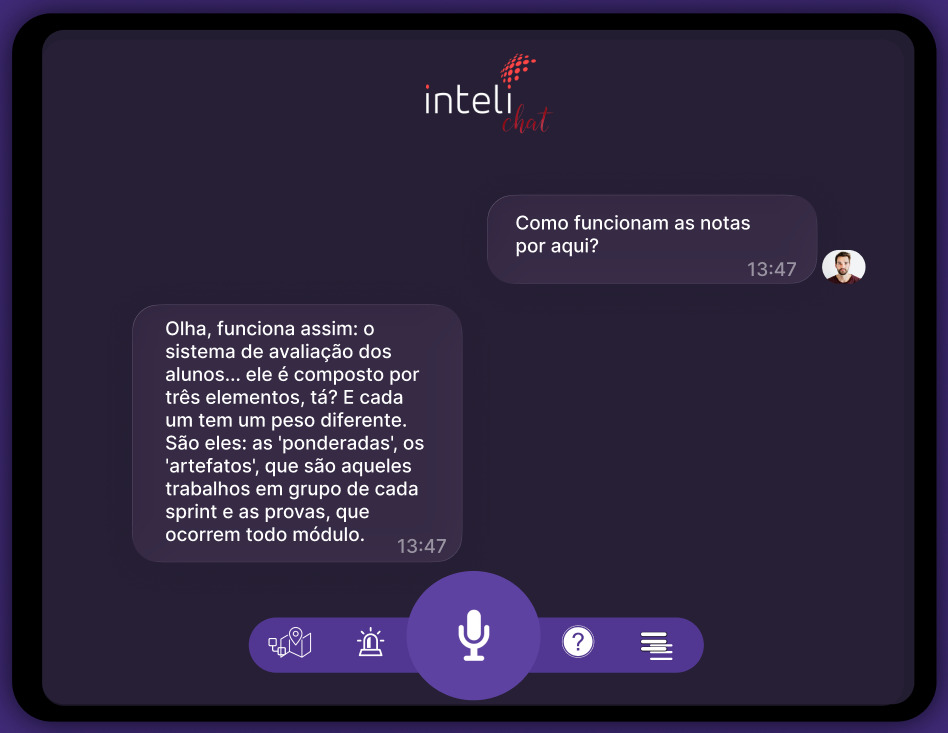

O LIA AI Audio Assistant é um assistente virtual de voz que utiliza tecnologias de IA avançadas para processar áudio, gerar respostas inteligentes e convertê-las novamente em áudio. O sistema implementa uma pipeline completa de Speech-to-Text (STT), processamento via LLM e Text-to-Speech (TTS), proporcionando uma experiência conversacional natural.

---

## 1. Visão Geral

### Objetivo

Plataforma de conversação por voz baseada em inteligência artificial que processa áudio, gera respostas e sintetiza voz.

### Características Principais

- Pipeline STT → LLM → TTS
- Interface web com Streamlit
- Transcrição com OpenAI Whisper
- Geração de respostas via Google Gemini
- Síntese de voz com Google Cloud TTS
- Suporte a MP3, WAV, M4A, OGG, FLAC
- Histórico de conversação

### Interface do Assistente

<div style={{ textAlign: "center" }}>
  <sup>Figura 1: Interface do LIA AI Audio Assistant</sup>
</div>



<div style={{ textAlign: "center" }}>
  <sub>Fonte: Produzida pelos Autores (2025).</sub>
</div>

---

## 2. Arquitetura do Sistema

### Camadas

**Apresentação**: Interface Streamlit para interação, upload e reprodução de áudio.

**STT**: Transcrição de áudio usando Whisper com detecção automática de idioma.

**LLM**: Processamento com Google Gemini 2.0 Flash para geração de respostas.

**TTS**: Síntese de voz com Google Cloud Text-to-Speech em português brasileiro.

### Fluxo de Dados

```
Usuário Upload Áudio → STT (Whisper) → Transcrição → LLM (Gemini) → Resposta Texto → TTS (Google Cloud) → Áudio Resposta → Usuário
```

---

## 3. Tecnologias Utilizadas

### Backend

- **Python 3.12**: Linguagem de programação principal
- **Streamlit 1.51.0**: Framework para criação da interface web interativa
- **Python-dotenv 1.2.1**: Gerenciamento de variáveis de ambiente

### Inteligência Artificial

- **OpenAI Whisper 20250625**: Modelo de transcrição de áudio (STT)
- **Google Generative AI**: SDK para integração com Gemini 2.0 Flash
- **Google Cloud Text-to-Speech 2.33.0**: Síntese de voz natural

### Processamento de Áudio

- **PyTorch 2.9.1**: Framework de deep learning para modelos de áudio
- **TorchAudio 2.9.1**: Biblioteca para processamento de áudio
- **FFmpeg**: Codificação e decodificação de formatos de áudio

### Machine Learning

- **Transformers 4.57.1**: Biblioteca Hugging Face para modelos transformer
- **Sentence-Transformers 5.1.2**: Embeddings semânticos de texto
- **Accelerate 1.11.0**: Otimização de treinamento e inferência

### Infraestrutura

- **CUDA 12.8**: Aceleração GPU para processamento de modelos
- **Logging**: Sistema integrado de logs para monitoramento

---

## 4. Configuração e Instalação

### Pré-requisitos

- Python 3.12 ou superior
- Conta Google Cloud com API Text-to-Speech habilitada
- Chave API do Google Gemini
- GPU NVIDIA com CUDA (opcional, mas recomendado)
- FFmpeg instalado no sistema
- Mínimo de 4GB de RAM disponível
- Mínimo de 2GB de espaço em disco

### Passos de Instalação

#### 1. Clonar o Repositório

```bash
git clone https://github.com/daviiabreu/embedding-models.git
cd embedding-models
```

#### 2. Criar Ambiente Virtual

```bash
python -m venv venv
```

#### 3. Ativar Ambiente Virtual

**Windows (PowerShell):**

```powershell
.\venv\Scripts\Activate.ps1
```

**Linux/Mac:**

```bash
source venv/bin/activate
```

#### 4. Instalar Dependências

```bash
pip install -r requirements.txt
```

**Nota**: A instalação pode demorar alguns minutos devido ao tamanho dos pacotes de deep learning (PyTorch, Transformers, etc.).

#### 5. Configurar Variáveis de Ambiente

Crie um arquivo `.env` na raiz do projeto:

```bash
GEMINI_API_KEY=sua_chave_gemini_aqui
GOOGLE_APPLICATION_CREDENTIALS=caminho/para/credentials.json
```

**Para obter as credenciais:**

- **Gemini API Key**: https://makersuite.google.com/app/apikey
- **Google Cloud Credentials**: https://console.cloud.google.com/apis/credentials

#### 6. Configurar Google Cloud

1. Acesse o Google Cloud Console
2. Crie um projeto ou selecione um existente
3. Habilite a API "Cloud Text-to-Speech"
4. Crie uma Service Account
5. Baixe o arquivo JSON de credenciais
6. Configure a variável `GOOGLE_APPLICATION_CREDENTIALS`

#### 7. Instalar FFmpeg (se necessário)

**Windows (via Chocolatey):**

```powershell
choco install ffmpeg
```

**Linux (Ubuntu/Debian):**

```bash
sudo apt update
sudo apt install ffmpeg
```

**Mac (via Homebrew):**

```bash
brew install ffmpeg
```

#### 8. Iniciar a Aplicação

**Interface Web (Streamlit):**

```bash
streamlit run streamlit_app.py
```

**Modo CLI (Pipeline):**

```bash
python main.py arquivo_audio.mp3
```

**Linux:**

```bash
python3 main.py arquivo_audio.mp3
```

A interface web estará disponível em: http://localhost:8501

---

## 5. Estrutura do Projeto

```
embedding-models/
│
├── main.py                       # Pipeline CLI principal
├── streamlit_app.py              # Interface web Streamlit
├── requirements.txt              # Dependências do projeto
├── .env                          # Variáveis de ambiente (não versionado)
├── .gitignore                    # Arquivos ignorados pelo Git
├── DOCUMENTATION.md              # Documentação completa (este arquivo)
│
├── pipeline/
│   ├── __init__.py              # Inicializador do módulo
│   └── llm_service.py           # Serviço de integração com Gemini
│
├── stt/
│   ├── __init__.py              # Inicializador do módulo
│   └── stt_service.py           # Serviço de transcrição (Whisper)
│
├── tts/
│   ├── __init__.py              # Inicializador do módulo
│   └── tts_service.py           # Serviço de síntese de voz (Google TTS)
│
├── input_audio/                  # Pasta para áudios de entrada (gerada)
│
├── output_audio/                 # Pasta para áudios gerados (gerada)
│
└── pipeline.log                  # Arquivo de logs (gerado)
```

---

## 6. Funcionalidades

### Speech-to-Text (STT)

Transcrição de áudio com modelo Whisper "base" (74M parâmetros). Suporta 99+ idiomas com detecção automática. Formatos aceitos: MP3, WAV, M4A, FLAC, OGG, AAC. Processamento local sem API externa.

### Large Language Model (LLM)

Modelo: gemini-2.0-flash
Configurações: Temperature 0.5, Top P 0.9, Top K 20, Max Tokens 500
Mantém histórico de conversa e implementa retry logic para falhas.

### Text-to-Speech (TTS)

Voz Puck em português brasileiro usando gemini-2.5-pro-tts. Saída em formato MP3.

### Pipeline

Modo arquivo único: `python main.py arquivo.mp3`
Modo batch: `python main.py` (processa todos os arquivos em input_audio/)
Logging: INFO, WARNING, ERROR em console e arquivo pipeline.log

### Interface Web

Componentes: área de chat, upload de áudio, preview, status da pipeline, player de resposta, botões de ação.
Gerenciamento de sessão com histórico persistente.

---

## 7. Módulos e Serviços

### STT Service (`stt/stt_service.py`)

#### Classe: N/A (Funcional)

**Função Principal: `transcribe_audio(audio_filepath: str) -> str | None`**

Transcreve arquivo de áudio para texto.

**Parâmetros:**
- `audio_filepath`: Caminho absoluto do arquivo de áudio

**Retorno:**
- `str`: Texto transcrito
- `None`: Em caso de erro

**Características:**
- Carregamento lazy do modelo Whisper
- Detecção automática de idioma
- Tratamento de erros robusto
- Logging detalhado

**Exemplo de Uso:**

```python
from stt_service import transcribe_audio

texto = transcribe_audio("input_audio/gravacao.mp3")
if texto:
    print(f"Transcrição: {texto}")
```

---

### LLM Service (`pipeline/llm_service.py`)

#### Classe: `LLMService`

Gerencia a comunicação com o Google Gemini.

**Métodos Principais:**

**`__init__(model_name: str = "gemini-pro")`**

Inicializa o serviço e configura o modelo.

**`setup_configurations()`**

Define configurações de segurança e geração.

**`setup_model()`**

Tenta configurar diferentes versões do Gemini.

**`create_prompt(user_transcription: str, context: str = None) -> str`**

Cria prompt otimizado para o modelo.

**Parâmetros:**
- `user_transcription`: Texto do usuário
- `context`: Contexto adicional opcional

**Retorno:**
- `str`: Prompt formatado

**`get_response(user_input: str, context: str = None, max_retries: int = 3) -> Optional[str]`**

Obtém resposta do Gemini com retry logic.

**Parâmetros:**
- `user_input`: Pergunta/texto do usuário
- `context`: Contexto da conversa
- `max_retries`: Número máximo de tentativas

**Retorno:**
- `str`: Resposta gerada
- `None`: Em caso de falha completa

**Configurações de Segurança:**

```python
safety_settings = [
    {"category": "HARM_CATEGORY_HARASSMENT", "threshold": "BLOCK_NONE"},
    {"category": "HARM_CATEGORY_HATE_SPEECH", "threshold": "BLOCK_NONE"},
    {"category": "HARM_CATEGORY_SEXUALLY_EXPLICIT", "threshold": "BLOCK_NONE"},
    {"category": "HARM_CATEGORY_DANGEROUS_CONTENT", "threshold": "BLOCK_NONE"}
]
```

**Função Utilitária:**

```python
from llm_service import get_llm_response

resposta = get_llm_response("Olá, como você está?")
print(resposta)
```

---

### TTS Service (`tts/tts_service.py`)

#### Classe: `TTSService`

Gerencia a síntese de voz usando Google Cloud.

**Métodos Principais:**

**`__init__()`**

Inicializa o serviço e cria diretórios.

**`setup_output_directory() -> Path`**

Cria e retorna o diretório de saída padrão.

**`normalize_output_path(output_path: str) -> Path`**

Normaliza e valida o caminho de saída.

**Parâmetros:**
- `output_path`: Caminho desejado

**Retorno:**
- `Path`: Caminho normalizado (sempre .mp3)

**`synthesize_speech(text: str, output_path: str, voice_speed: bool = False) -> bool`**

Converte texto em áudio.

**Parâmetros:**
- `text`: Texto para sintetizar
- `output_path`: Caminho do arquivo de saída
- `voice_speed`: Velocidade da voz (não implementado)

**Retorno:**
- `bool`: True se sucesso, False caso contrário

**Configuração da Voz:**

```python
voice = texttospeech.VoiceSelectionParams(
    language_code="pt-BR",
    name="Puck",
    model_name="gemini-2.5-pro-tts"
)
```

**Função Utilitária:**

```python
from tts_service import text_to_speech

sucesso = text_to_speech("Olá, mundo!", "output_audio/resposta.mp3")
if sucesso:
    print("Áudio gerado com sucesso!")
```

---

## 8. API da Pipeline

### Classe: `AudioPipeline` (main.py)

#### Métodos Principais:

**`__init__()`**

Inicializa a pipeline e cria diretórios necessários.

**`setup_directories()`**

Cria os diretórios `input_audio/` e `output_audio/`.

**`process_audio(audio_filename: str, conversation_context: str = None) -> tuple`**

Processa um arquivo de áudio através da pipeline completa.

**Parâmetros:**
- `audio_filename`: Nome do arquivo em `input_audio/`
- `conversation_context`: Contexto opcional da conversa

**Retorno:**
```python
(sucesso: bool, caminho_audio: str, transcrição: str, resposta_llm: str)
```

**Fluxo de Execução:**

1. Validar existência do arquivo
2. Criar timestamp para identificação
3. **ETAPA 1**: Transcrever áudio → STT
4. **ETAPA 2**: Enviar para LLM → Resposta
5. **ETAPA 3**: Converter para áudio → TTS
6. Retornar resultados

**`process_all_audio_files()`**

Processa todos os arquivos de áudio na pasta `input_audio/`.

**Características:**
- Processa em lote
- Gera relatório final
- Estatísticas de sucesso/falha

**Exemplo de Uso:**

```python
from main import AudioPipeline

pipeline = AudioPipeline()

# Processar arquivo específico
sucesso, audio_path, texto, resposta = pipeline.process_audio("pergunta.mp3")

if sucesso:
    print(f"Transcrição: {texto}")
    print(f"Resposta: {resposta}")
    print(f"Áudio gerado: {audio_path}")

# Processar todos os arquivos
pipeline.process_all_audio_files()
```

---

## 9. Fluxo de Processamento

### Pipeline Completa - Detalhado

#### Fase 1: Inicialização

```python
pipeline = AudioPipeline()
pipeline.setup_directories()
```

1. Criar diretórios `input_audio/` e `output_audio/`
2. Configurar logging
3. Inicializar serviços (lazy loading)

#### Fase 2: Recebimento de Áudio

**Interface Streamlit:**
```python
uploaded_file = st.file_uploader(...)
```

**CLI:**
```python
audio_filename = sys.argv[1]
```

1. Validar formato do arquivo
2. Verificar tamanho do arquivo
3. Salvar na pasta `input_audio/`

#### Fase 3: Transcrição (STT)

```python
transcription = transcribe_audio(str(audio_path))
```

**Processo:**
1. Carregar modelo Whisper (primeira execução)
2. Preprocessar áudio
3. Executar transcrição
4. Detectar idioma
5. Retornar texto limpo

**Tempo estimado:** 2-10 segundos (dependendo do tamanho)

#### Fase 4: Processamento LLM

```python
llm_response = get_llm_response(transcription, conversation_context)
```

**Processo:**
1. Criar prompt contextualizado
2. Configurar parâmetros de geração
3. Enviar requisição ao Gemini
4. Aplicar retry logic se necessário
5. Validar resposta
6. Retornar texto da resposta

**Tempo estimado:** 1-5 segundos

#### Fase 5: Síntese de Voz (TTS)

```python
audio_success = text_to_speech(llm_response, str(output_path))
```

**Processo:**
1. Validar texto de entrada
2. Configurar cliente Google Cloud
3. Configurar voz e parâmetros
4. Executar síntese
5. Salvar arquivo MP3
6. Retornar status de sucesso

**Tempo estimado:** 1-3 segundos

#### Fase 6: Apresentação

**Interface Streamlit:**
1. Adicionar mensagens ao histórico
2. Atualizar status da pipeline
3. Exibir áudio no player
4. Disponibilizar download

**CLI:**
1. Logar resultados no console
2. Salvar em `pipeline.log`
3. Exibir relatório final

---

## 10. Gerenciamento de Erros

### Estratégias Implementadas

#### 1. Validação de Entrada

```python
if not audio_path.exists():
    logging.error(f"Arquivo não encontrado: {audio_path}")
    return False, None, None, None
```

**Verificações:**
- Existência do arquivo
- Formato válido
- Tamanho aceitável
- Texto não vazio (TTS)

#### 2. Try-Except em Todas as Etapas

```python
try:
    transcription = transcribe_audio(str(audio_path))
    if not transcription:
        logging.error("Falha na transcrição")
        return False, None, None, None
except Exception as e:
    logging.error(f"Erro na pipeline: {e}")
    import traceback
    logging.error(traceback.format_exc())
    return False, None, None, None
```

#### 3. Retry Logic (LLM)

```python
def get_response(self, user_input: str, context: str = None, max_retries: int = 3):
    for attempt in range(max_retries):
        try:
            # Tentativa de processamento
            response = self.model.generate_content(prompt, **config)
            # ...
        except Exception as e:
            if attempt < max_retries - 1:
                continue  # Tenta novamente
            else:
                return "Desculpe, ocorreu um erro..."
```

#### 4. Fallback Responses

**LLM bloqueado por safety:**
```python
if finish_reason == 2:  # SAFETY
    return "Desculpe, não posso responder a essa pergunta específica."
```

**Erro de transcrição:**
```python
if not transcription:
    return "Não foi possível transcrever o áudio."
```

#### 5. Logging Detalhado

```python
logging.basicConfig(
    level=logging.INFO,
    format='%(asctime)s - %(levelname)s - %(message)s',
    handlers=[
        logging.FileHandler('pipeline.log'),
        logging.StreamHandler()
    ]
)
```

**Níveis:**
- **INFO**: Operações normais
- **WARNING**: Situações anormais não críticas
- **ERROR**: Falhas que impedem operação

---

## 11. Exemplos de Uso

### Exemplo 1: Uso via CLI - Arquivo Único

```bash
python main.py pergunta.mp3
```

**Saída Esperada:**

```
Iniciando Pipeline de Áudio
Diretório de entrada: C:\Users\...\input_audio
Diretório de saída: C:\Users\...\output_audio
Processando arquivo específico: pergunta.mp3
Iniciando transcrição de: pergunta.mp3
Transcrição concluída: Qual é a capital do Brasil?...
Enviando para LLM...
Resposta da LLM: A capital do Brasil é Brasília...
Convertendo resposta para áudio...
Áudio gerado: C:\Users\...\output_audio\pergunta_response_20251118_143022.mp3
Pipeline concluída com sucesso!
Transcrição: Qual é a capital do Brasil?
Resposta LLM: A capital do Brasil é Brasília, localizada no Distrito Federal...
Áudio gerado: C:\Users\...\output_audio\pergunta_response_20251118_143022.mp3
```

### Exemplo 2: Uso via CLI - Modo Batch

```bash
python main.py
```

**Estrutura da Pasta:**

```
input_audio/
├── audio1.mp3
├── audio2.wav
└── audio3.m4a
```

**Saída Esperada:**

```
Iniciando Pipeline de Áudio
Processando todos os arquivos na pasta de entrada
Encontrados 3 arquivos para processar

==================================================
Processando: audio1.mp3
Iniciando transcrição de: audio1.mp3
Transcrição concluída: ...
Enviando para LLM...
Resposta da LLM: ...
Convertendo resposta para áudio...
Áudio gerado: ...

==================================================
Processando: audio2.wav
...

==================================================
RELATÓRIO FINAL
Sucessos: 3/3
[OK] audio1.mp3
[OK] audio2.wav
[OK] audio3.m4a
```

### Exemplo 3: Uso via Streamlit - Interface Web

**Passo a Passo:**

1. **Iniciar aplicação:**
```bash
streamlit run streamlit_app.py
```

2. **Acessar no navegador:**
```
http://localhost:8501
```

3. **Fazer upload de áudio:**
   - Clicar em "Browse files"
   - Selecionar arquivo de áudio
   - Visualizar preview do áudio

4. **Processar:**
   - Clicar em "Processar Áudio"
   - Acompanhar status em tempo real:
     - Upload do Áudio
     - Transcrição (STT)
     - Processamento LLM
     - Síntese de Voz (TTS)
     - Concluído

5. **Ver resultado:**
   - Mensagem do usuário aparece no chat
   - Resposta do bot aparece no chat
   - Player de áudio disponível
   - Botão de download habilitado

6. **Continuar conversação:**
   - Fazer upload de novo áudio
   - Contexto mantido automaticamente
   - Histórico persistente

### Exemplo 4: Integração Programática

```python
from pathlib import Path
from main import AudioPipeline

# Inicializar pipeline
pipeline = AudioPipeline()

# Processar áudio com contexto
audio_file = "minha_pergunta.mp3"
contexto = "O usuário está perguntando sobre tecnologia"

sucesso, audio_resposta, transcricao, resposta = pipeline.process_audio(
    audio_file,
    conversation_context=contexto
)

if sucesso:
    print("Processamento concluído com sucesso!")
    print(f"Você disse: {transcricao}")
    print(f"LIA respondeu: {resposta}")
    print(f"Áudio salvo em: {audio_resposta}")
    
    # Usar áudio gerado
    import os
    os.system(f"start {audio_resposta}")  # Windows
    # os.system(f"open {audio_resposta}")  # Mac
    # os.system(f"xdg-open {audio_resposta}")  # Linux
else:
    print("Falha no processamento")
```
